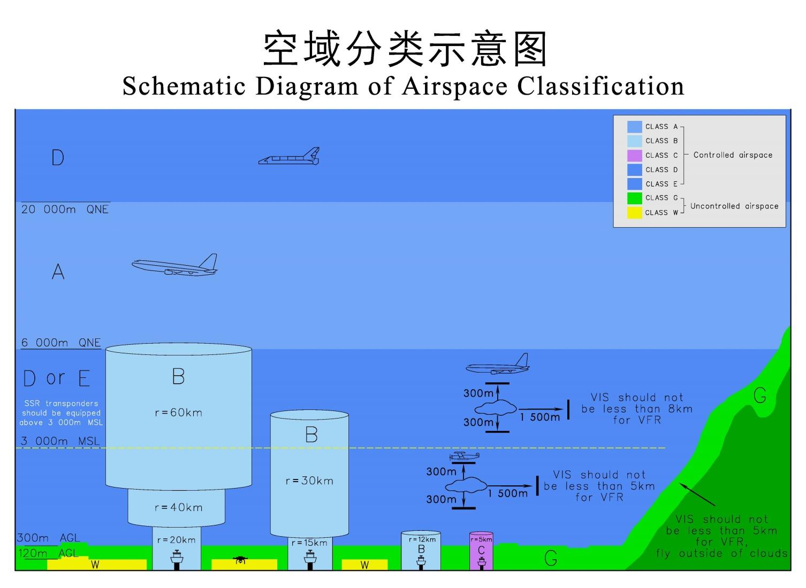

# 空域

## 1. 空域分类示意图

## 2. 空域分类区别速览表

> [!NOTE]
> 图例：IFR=仪表飞行规则；VFR=目视飞行规则；应答机=二次雷达应答机/同等性能监视设备

| 对比维度       | **A类**           | **B类**           | **C类**              | 
|:-----------|:-----------------|:-----------------|:--------------------|
| **划设范围**   | 标准气压6000m~20000m | 运输机场上空,通常为环状阶梯结构 | 通用机场上空（半径5km，高600m） | 
| **空管服务**   | 配备间隔             | 配备间隔             | 配备间隔/信息提供           | 
| **允许飞行规则** | IFR              | IFR/VFR          | IFR/VFR             |
| **通信要求**   | 双向无线电            | 双向无线电            | 双向无线电               | 
| **监视设备**   | 应答机              | 应答机              | 应答机或可被监视设备          |
| **进入许可**   | 审批 + 获批许可        | 审批 + 获批许可        | 审批 + 获批许可           | 
| **速度限制**   | 无特殊限制            | 无特殊限制            | VFR IAS ≤ 450km/h   | 

| 对比维度       | **D类**                        | **E类**                    |
|:-----------|:------------------------------|:--------------------------|
| **划设范围**   | 标准气压20000m以上或A/B/C/G类之外可选划设区域 | 同D类                       | 
| **空管服务**   | 配备间隔/信息提供                     | 仅为**仪表飞行**提供管制服务（目视仅提供信息） | 
| **允许飞行规则** | IFR/VFR                       | 同D类                       | 
| **通信要求**   | 双向无线电                         | IFR：双向无线电；VFR：守听频率        |
| **监视设备**   | >3000m：应答机 <3000m：可监视设备       | 同D类                       |
| **进入许可**   | 审批 + 获批许可                     | IFR：审批+许可；VFR：报告+守听       | 
| **速度限制**   | MSL≤3000m时IAS≤450km/h         | 同D类                       | 

| 对比维度       | **G类**                        | **W类**       |
|:-----------|:------------------------------|:-------------|
| **划设范围**   | B/C外真高<300m(除W空域外)或<6000m无影响区 | G类空域内真高<120m |
| **空管服务**   | 仅**飞行信息服务**）                  | 无            |
| **允许飞行规则** | IFR/VFR                       | 微型/轻/小型无人机   |
| **通信要求**   | IFR：双向无线电；VFR：守听频率            | 广播式自动发送识别    |
| **监视设备**   | 安装或携带可被监视设备                   | 自动发送识别       |
| **进入许可**   | 报备飞行计划                        | 小型无人机需操控员执照  |
| **速度限制**   | MSL≤3000m时IAS≤450km/h         | 无特殊限制        |

**目视飞行气象条件（VFR最低标准）**

| 飞行高度                        | 能见度    | 距云水平距离   | 距云垂直距离  |
|:----------------------------|:-------|:---------|:--------|
| **平均海平面 ≥ 3000m**           | ≥ 8 km | ≥ 1500 m | ≥ 300 m |
| **900m（或真高300m取高值）~ 3000m** | ≥ 5 km | ≥ 1500 m | ≥ 300 m |
| **＜ 900m（或真高300m取高值）**      | ≥ 5 km | 云外飞行     | 云外飞行    |

## 3. 空域定义

根据航空器飞行规则、性能要求、空域环境及空管服务内容等要素，将空域划分为`A、B、C、D、E、G、W`共七类。  
其中，`A、B、C、D、E`类为管制空域，实现通信和监视覆盖；`G、W`类为非管制空域，`G`类空域实现监视覆盖。

### 3.1 A类空域

- 划设范围：通常为标准气压高度`6000米`（含）至标准气压高度`20000米`（含）。
- 服务内容：为所有飞行提供空中交通管制服务，并配备间隔。
- 飞行要求：
    - 通常仅允许仪表飞行；
    - 须保持与空中交通管理部门的持续双向无线电通信；
    - 须安装二次雷达应答机或同等性能的监视设备；
    - 飞行计划须经审批，进入空域前须获得空中交通管理部门许可；
    - 驾驶员须具备仪表飞行能力及相应资质。

> [!NOTE]
> 经空中交通管理部门特别批准，航空器可按照目视飞行规则在A类空域飞行

### 3.2 B类空域

- 划设范围：划设在民用运输机场上空。
  具体划设标准按跑道数量如下所示：
    - 三跑道（含）以上：半径`20km、40km、60km`三环阶梯，道面—机场标高以上`900m`（含）；`900m—1800m`（含）；`1800m—标准气压高度6000m`
    - 双跑道：半径`15km、30km`双环阶梯，道面—机场标高以上`600m`（含）；`600m—3600m`（含），顶层最高至A类空域下限
    - 单跑道：半径`12km`单环，道面—机场标高以上`600m`（含）
- 服务内容：为所有飞行提供空中交通管制服务，并配备间隔。
- 飞行要求：同A类空域

### 3.3 C类空域

- 划设范围：划设在建有塔台的通用航空机场上空，通常为半径`5千米`、跑道道面至机场标高以上`600米`（含）的单环结构。
- 服务内容：为所有飞行提供空中交通管制服务。
    - 为仪表与仪表、仪表与目视飞行之间配备间隔；
    - 为目视与目视飞行之间提供交通信息，并根据要求提供避让建议。
- 飞行要求：
    - 允许仪表飞行和目视飞行；
    - 平均海平面高度`3000米`以下时，目视飞行指示空速不大于`450千米/小时`；
    - 须保持与空中交通管理部门的持续双向无线电通信；
    - 须安装二次雷达应答机或其他可被监视的设备；
    - 飞行计划须经审批，进入空域前须获得空中交通管理部门许可；
    - 驾驶员须具备仪表或目视飞行能力及相应资质。

> [!NOTE]
> 经空中交通管理部门特别批准，航空器可以超过限制速度在C类空域飞行

### 3.4 D类空域 与 E类空域

- 划设范围：
    - 标准气压高度20000米以上为D类空域；
    - A、B、C、G类空域以外区域，可根据运行需求和安全要求选择划设为D类或E类空域。
- 服务内容：
    - D类: 为所有飞行提供空中交通管制服务。为仪表飞行之间配备间隔；为仪表飞行提供目视飞行的交通信息及避让建议；为目视飞行提供仪表及目视飞行的交通信息及避让建议
    - E类: 仅为仪表飞行提供空中交通管制服务。为仪表飞行之间配备间隔；尽可能为仪表飞行提供目视飞行的交通信息；尽可能为目视飞行提供仪表及目视飞行的交通信息
- 通用飞行要求：
    - 允许仪表飞行和目视飞行；
    - 平均海平面高度`3000米`以下时，指示空速不大于`450千米/小时`；
    - 平均海平面高度`3000米`以上须安装二次雷达应答机或同等性能的监视设备，`3000米`以下须安装其他可被监视的设备；
    - 须报备飞行计划；
    - 驾驶员须具备仪表或目视飞行能力及相应资质。
- 特殊飞行要求：
    - D类: 仪表飞行与目视飞行进入前均须获得空中交通管理部门许可，并保持持续双向无线电通信
    - E类: 仪表飞行进入前须获得许可并保持持续双向无线电通信；目视飞行无须许可，但进入前须报告并在规定通讯频率上守听

> [!NOTE]
> 经空中交通管理部门特别批准，航空器可以超过限制速度在D/E类空域飞行

### 3.5 G类空域

- 划设范围：
    - B、C类空域以外真高`300米`以下的空域（W类空域除外）；
    - 平均海平面高度低于`6000米`、对民用航空公共运输飞行无影响的空域。
- 服务内容：仅提供飞行信息服务，不提供空中交通管制服务。
- 飞行要求：
    - 允许仪表飞行和目视飞行；
    - 平均海平面高度`3000米`以下时，指示空速不大于`450千米/小时`；
    - 仪表飞行须保持与空中交通管理部门的持续双向无线电通信；目视飞行须在规定通讯频率上守听；
    - 须安装或携带可被监视的设备；
    - 须报备飞行计划；
    - 驾驶员须具备仪表或目视飞行能力及相应资质。

> [!NOTE]
> 经空中交通管理部门特别批准，航空器可以超过限制速度在G类空域飞行

### 3.6 W类空域

- 划设范围：`G类`空域内`真高120米以下`的部分空域。
- 适用范围：微型、轻型、小型无人驾驶航空器飞行。
- 飞行要求：
    - 飞行过程中须广播式自动发送识别信息；
    - 小型无人驾驶航空器操控员须取得操控员执照。

## 4. 参考资料

1. [CAAC.国家空域基础分类方法](https://www.caac.gov.cn/XXGK/XXGK/TZTG/202312/P020231222621680839714.pdf)

[《无人驾驶航空器飞行管理暂行条例》]: https://www.gov.cn/zhengce/content/202306/content_6888799.htm
