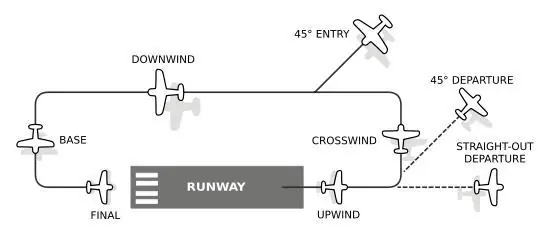
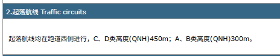
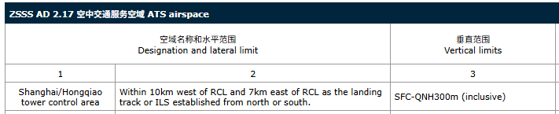

# 本场起落航线

## 前言

在联飞中，并非每次飞行都需要长途转场。本场起落航线（Traffic Pattern），俗称"五边飞行"，
是指航空器在本场上空按矩形航线连续进行起飞、爬升、转弯、下降与着陆的训练飞行方式。
它是飞行训练的基本科目，也是新手熟悉陆空通话、打磨基本功的最佳途径。
只需一个机场、一个塔台频率，就能完整体验从放行到落地的全部环节。

本章将介绍起落航线的基本概念、五边构成、运行规则，并以一次完整的本场起落为例演示全程通话。陆空通话的基本规则请先阅读[陆空对话](./airground)。

## 1. 什么是起落航线

起落航线是航空器在机场上空建立的矩形航线，通常由五个直边和四个 90° 转弯构成。

[《中华人民共和国飞行基本规则》]第五十一条规定：

- 机场的起落航线**通常为左航线**；若因地形、城市等条件限制，或为避免与邻近机场的起落航线交叉，也可以为右航线；
- 起落航线的飞行高度**通常为 300 米至 500 米**。

> [!TIP]
> 具体航线方向与高度以塔台指令和机场细则为准。

## 2. 五边详解

以标准左航线为例，五个边及四个转弯如下：

| 边次  | 俗称        | 英语        | 航线位置  | 要点                           |
|:----|:----------|:----------|:------|:-----------------------------|
| 第一边 | 逆风边 / 迎风边 | Upwind    | 沿跑道方向 | 起飞后保持跑道方向直线爬升至航线高度           |
| 第二边 | 侧风边       | Crosswind | 垂直于跑道 | 一转弯后横穿跑道侧方，继续爬升              |
| 第三边 | 顺风边 / 下风边 | Downwind  | 平行于跑道 | 二转弯后与起飞方向相反平飞，保持航线高度，完成着陆前检查 |
| 第四边 | 底边        | Base      | 垂直于跑道 | 三转弯后转回跑道一侧，开始下降，控制高度与速度      |
| 第五边 | 最后进近      | Final     | 对正跑道  | 四转弯后对正跑道，稳定进近，等待管制的落地或连续起飞许可 |

四个转弯按顺序称为**一转弯、二转弯、三转弯、四转弯**，管制指令中常以转弯位置下达间隔指令。

下图为一个标准左起落航线的示意图

*图片来源于 [百度百科-五边飞行](https://baike.baidu.com/item/%E4%BA%94%E8%BE%B9%E9%A3%9E%E8%A1%8C/8704257)*

第三边距跑道侧方的距离没有统一标准，一般以能清楚目视跑道、便于四转弯后直接对正为原则，小型航空器通常保持在跑道侧方 1—2 公里。

## 3. 起落航线的运行规则

依据[《中华人民共和国飞行基本规则》]第五十条、第五十一条、第五十六条，在本场起落时应当遵守：

- **加入须经许可**：加入起落航线飞行必须经空中交通管制员许可，并应顺沿航线加入，不得横向截入；
- **保持间距**：同一航线内各航空器之间的距离一般应保持在 1500 米以上；
- **禁止同型超越**：不得超越同型航空器。经管制许可，速度大的航空器可以在第三转弯前从外侧超越速度小的航空器，间隔不得小于200米；除必须立即降落的航空器外，任何航空器不得从内侧超越前机；
- **进跑道时机**：准备起飞的航空器，通常在航线四转弯后无其他航空器进入着陆时，经管制许可方可进入跑道；
- **快速脱离**：航空器着陆后，应迅速脱离跑道；
- **目视观察**：起落航线属于目视飞行，全程保持目视观察、主动避让。

> [!CAUTION]
> 航空器进行训练飞行连续起落时，除后方航空器驾驶员能保证在高于前方航空器航径的高度以上飞行外，
> 其尾流间隔时间应当在现行标准基础上增加1分钟。详见[航空器尾流间隔](./turbulence)

## 4. 本场起落完整示例

假设您驾驶一架塞斯纳 172（注册号 `B-2352`）在上海虹桥国际机场，计划执行本场连续起落训练。

> [!TIP]
> 飞行计划通常选择VFR，起飞与到达机场填写同一机场，航路为LOCAL，具体参见[飞行计划提交](../tutorial/flightplan)。

> [!NOTE]
> 以下通话均为示例，具体用语和间隔指令以管制员实际指挥为准。

### 4.1 第一边

完成检查单后向塔台申请起飞：

飞行员:

- 塔台，B-2352，[通播 Alpha 抄收，]申请起落练习。
- Tower, B-2352, [with information Alpha,], request local training.

此时管制员会根据机场运行细则来给予许可，对于上海虹桥国际机场来说，其机场运行细则第2.22.2条明确写到

> [!TIP]
> 这里的`ABCD`是[进近速度分类](./aircraft_type.md#1-进近速度分类)

> [!DANGER]
> 虽然上海虹桥国际机场的机场运行细则内写的C、D类高度(QNH)450m  
> 但在机场运行细则第2.17条明确写到  
> 
> **虹桥塔台无法对(QNH)300米(含)以上的航空器提供管制服务**

塞斯纳172属于A类飞机，高度为300米。假设上海虹桥国际机场18R离场，跑道西边的起落航线对于18R来说，即[右起落航线|如果是36L离场，则变成左起落航线]

管制员:

- B-2352，跑道 36，地面风 330，3 米/秒，可以起飞。
- B-2352, runway 36, surface wind 330 degrees, 3 meters per second, cleared for take-off.

飞行员:

- 跑道 36，可以起飞，B-2352。
- Runway 36, cleared for take-off, B-2352.

### 4.2 建立航线（第二、三边）

离地后保持跑道方向爬升，通过航线高度 300 米后一转弯进入第二边，二转弯建立第三边，随后向管制报告：

飞行员:

- B-2352，三边建立。
- B-2352, downwind.

管制员:

- B-2352，收到。
- B-2352, roger.

若五边或四边已有航空器，管制会以延长三边等方式调整间隔：

管制员:

- B-2352，延长三边。
- B-2352, extend downwind.

飞行员:

- 延长三边，B-2352。
- Extend downwind, B-2352.

### 4.3 四转弯与五边（第四、五边）

三转弯后转入第四边并开始下降，四转弯对正跑道 36。落地许可通常在四边或五边发布：

管制员:

- B-2352，跑道 36，可以连续起飞。
- B-2352, runway 36, cleared touch and go.

飞行员:

- 跑道 36，可以连续起飞，B-2352。
- Runway 36, cleared touch and go, B-2352.

接地后保持方向、再次起飞，重复上述航线。每一圈落地前都应等待管制发布连续起飞或落地许可；若短五边仍未收到许可，应做好复飞准备。

### 4.4 全停与脱离

训练结束前，在三边向管制报告全停意图：

飞行员:

- B-2352，本场最后一个，全停。
- B-2352, final circuit, make full stop.

管制员:

- B-2352，跑道 36，可以落地，落地全停。
- B-2352, runway 36, cleared to land, make full stop.

飞行员:

- 跑道 36，可以落地，落地全停，B-2352。
- Runway 36, cleared to land, make full stop, B-2352.

着陆后迅速脱离跑道并报告：

飞行员:

- B-2352，跑道 36 脱离了。
- B-2352, runway vacated.

管制员:

- B-2352，自行滑行至停机坪，关车报。
- B-2352, taxi to apron by your own choice, report engine shutdown.

## 5. 常用指令速查

| 指令     | 英语                   | 含义              |
|:-------|:---------------------|:----------------|
| 可以连续起飞 | CLEARED TOUCH AND GO | 接地后继续起飞，保持航线    |
| 落地全停   | MAKE FULL STOP       | 落地后停止滑跑，脱离跑道    |
| 可以低空通场 | CLEARED LOW PASS     | 不接地，低高度沿跑道通过后复飞 |
| 复飞     | GO AROUND            | 中止着陆，立即爬升       |
| 延长三边   | EXTEND DOWNWIND      | 继续沿第三边飞行，加大间隔   |

> [!IMPORTANT]
> 连续起飞、低空通场等必须得到管制许可后才能执行，切勿想当然。

## 6. 注意事项

### 6.1 起飞前抄收通播

进入跑道前注意通播中的风向风速与跑道在用信息，确认天气满足目视飞行条件，并按要求向管制报告通播代码。

### 6.2 全程守听并目视观察

起落航线是目视飞行，守听频率的同时应保持对四边、五边及跑道方向的目视观察，主动发现同场航空器。

### 6.3 服从间隔指令

机场繁忙时，管制可能要求延长三边、缩短航线或要求全停让出航线，请无条件服从，有疑问时在脱离跑道后再行询问。

### 6.4 不确定就复飞

五边不稳定、失去落地许可或跑道被占用时，果断复飞是标准处置，无需紧张，复飞后按管制指令重新加入航线。

## 结语

本场起落航线看似简单，却浓缩了起飞、爬升、平飞、下降、进近、着陆与陆空通话的全部基本功。希望本教程能帮助您顺利完成第一个本场起落，在反复的五边中积累信心——下次联飞，不妨从一圈全停开始。

## 参考资料

[1] [国务院、中央军委.《中华人民共和国飞行基本规则》](https://www.gov.cn/zhengce/content/2008-03/28/content_3240.htm)
[2] [CAAC.MH/T 4014-2003.空中交通无线电通话用语](https://www.caac.gov.cn/XXGK/XXGK/BZGF/HYBZ/201511/P020170804579259214829.pdf)
[3] [中国航空网.塔台运行手册（训练飞行标准用语）](http://www.aero.cn/2011/1008/27163_17.html)

[《中华人民共和国飞行基本规则》]: https://www.gov.cn/zhengce/content/2008-03/28/content_3240.htm
