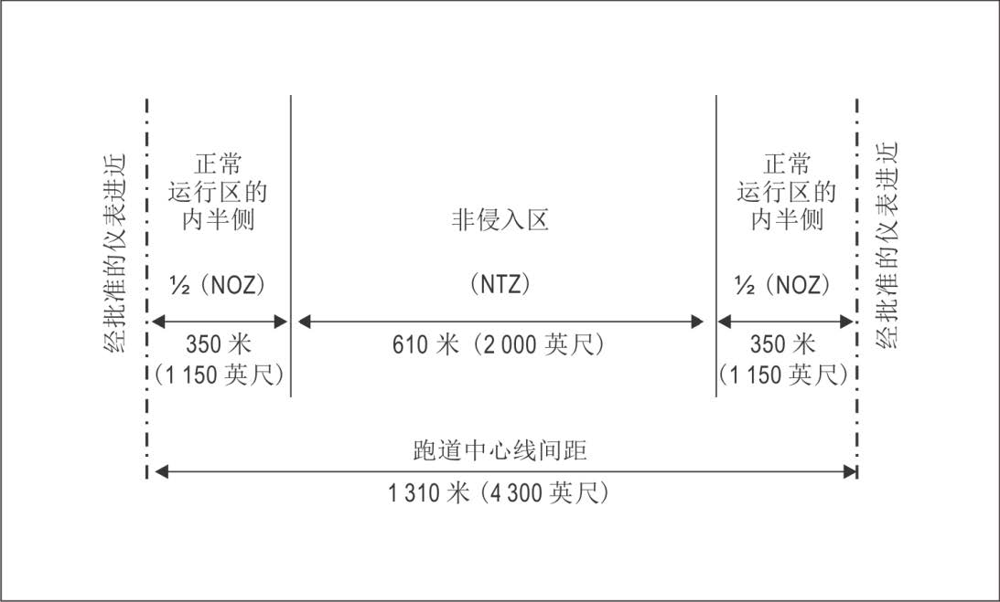
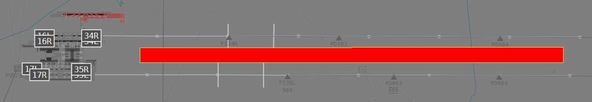

# 平行或近似平行跑道运行

## 1. 简介

平行跑道或相似平行跑道的运行，自古以来就是一个**难题**，而在中国大陆境内，考虑到日益增长的客流量，各机场在不断扩建后，各类跑道拔地而起。
因此，管制员应熟练掌握本部分内容，并作为记忆项目背诵。飞行员应当了解本部分内容。

平行跑道的同时仪表运行应在运行前取得民航总局审批。但，存在少数机场存在平行跑道，开放而未取得许可。
针对这种情况，我们推荐使用隔离平行运行模式，尽量接近真实。

## 2. 运行模式

按照[《平行跑道同时仪表运行管理规定》]有关规定

在中国大陆境内，平行跑道同时仪表运行按照跑道用于进近和离场的使用方式分为`四种`，分别是：

1. 独立平行仪表进近
2. 相关平行仪表进近
3. 独立平行离场
4. 隔离平行运行

除此以外，也可以按照运行模式分为`半混合运行`和`混合运行`

## 3. 独立平行仪表进近

### 3.1 定义

在相邻的平行跑道仪表着陆系统上进近的航空器之间不需要配备规定的雷达间隔时，在平行跑道上同时进行的仪表着陆系统进近的运行模式。

### 3.2 跑道间距条件

两条平行跑道中心线的间距不小于`1035米`时。

### 3.3 管制员要求

1. 在航空器管制员和进近管制建立通信联络后，尽早告知正在实施独立平行仪表进近并告知其使用的跑道号。此项情报可以通过ATIS广播提供。
2. 雷达屏幕上已显示`非侵入区`
3. 雷达引导航空器切入仪表着陆系统航向道时，最后的引导必须能够使得航空器以不大于`30度`的角度切入航向道，并且在切入前至少有
   `2千米`的直线平飞阶段。且在建立下滑道之前，至少有`4千米`的平飞阶段。
   > [!CAUTION]
   > 进行独立平行仪表进近时不得进行`程序转弯`。  
   > `程序转弯`是一种机动飞行，指的是航空器先转弯脱离指定航迹接着向反方向转弯，切入并沿指定航迹的反方向飞行。  
   > 通常分为`45°/180°程序转弯`和`80°/260°程序转弯`，有左右的区别
4. 在已建立的仪表着陆系统航向道上向台飞行且在正常运行区内飞行时，可以忽略不小于`300米`的垂直间隔或者`5.6千米`的雷达间隔（对侧飞机）。
   > [!CAUTION]
   > 同航道的飞机仍然有至少`300米`的垂直间隔或者至少`5.6千米`的雷达间隔的限制，不得解除
5. 使用`高边`和`低边`进行引导，`高边`和`低边`航空器在建立各自的航向道之前有`300米`的高度差。
6. 在截获下滑道后，发布继续进近许可。
7. 监视航空器不进入`非侵入区`，同时保证航空器之间存在安全间隔。如进入，则及时引导回到正确航迹，且引导受影响的航空器立即爬升和转弯到指定的高度和航向，以避开偏航的航空器。
8. 管制员需要对机场有持续的雷达监视，保证雷达管制员能够随时掌握使用目视间隔的情况。但如航空器直接满足以下条件之一：
    - 航空器之间已经建立了目视间隔；
    - 航空器已经着陆；
    - 航空器复飞至距离跑道起飞末端外至少2千米并且与其他航空器之间已经建立安全间隔。

   则可以不再监视。通常来讲管制员不再需要通知机组雷达监视服务已终止。
9. 恶劣气象条件下，及时中止平行跑道独立平行仪表进近。

### 3.4 非侵入区（NTZ）

1. 定义：位于相邻跑道中心线延长线之间的特定空域。以保证航空器偏离航向道时的飞行安全。
2. 划分：同前文所述，本部分将不再赘述，有兴趣的可以自行查阅[《平行跑道同时仪表运行管理规定.中国民用航空总局.CCAR-98TM》]

### 3.5 正常运行区（NOZ）

1. 定义：从仪表着陆系统（ILS）航向道中心线向两侧延伸至指定范围内的空域。
2. 划分：同上。

> [!TIP]
> 在模拟飞行中，不是这个机场拥有独立平行仪表进近的能力即可。  
> 一般情况下，我们`极度不推荐`拥有该资质的机场进行此运行模式。  
> 涉及到多方面的角度，在这里不做展开，~~当然其中最重要的原因也许是为了防止管制员被EuroScope报警吵亖~~。

## 4. 相关平行仪表进近

### 4.1 定义

在相邻的平行跑道仪表着陆系统上进近的航空器之间需要配备规定的雷达间隔时，在平行跑道上同时进行的仪表着陆系统进近的运行模式。

### 4.2 跑道间距条件

两条平行跑道中心线的间距不小于`915米`时。

### 4.3 管制员要求

1. 进近管制告知航空器管制员，两条跑道均可进近。此项情报可以通过ATIS广播提供。
2. 在引导航空器切入平行仪表着陆系统航向道时，管制员应当为航空器提供不小于`300米`的垂直间隔或者`5.6千米`的雷达间隔。
3. 已建立仪表着陆系统航向道的航空器之间的雷达间隔应当符合下列规定：
    - 在同一个仪表着陆系统航向道上的航空器之间的雷达间隔不小于`5.6千米`。
    - 航空器之间存在尾流影响的，应当符合规定的尾流间隔；
4. 在两条相邻的仪表着陆系统航向道上同时进近的航空器之间的雷达间隔不小于`4千米`。

## 5. 独立平行离场

1. 离场航空器在平行跑道上沿相同方向同时起飞的运行模式。但当两条平行跑道的间距小于760米，航空器可能受尾流影响时，平行跑道离场航空器的放行间隔应当按照为一条跑道规定的放行间隔执行。
2. 两条平行跑道中心线的间距不小于`760米`时。
3. 按照分配的标准程序离场。

## 6. 隔离平行运行

1. 在平行跑道上同时进行的运行，其中一条跑道只用于离场，另一条跑道只用于进近。
2. 两条平行跑道中心线的间距不小于`760米`时，出现下列情形的，跑道中心线的间距应当符合下列规定：
    - 以进近的方向为准，当进近使用的跑道入口相对于离场跑道入口每`向后错开150米`时，平行跑道中心线的最小间距可以`减少30米`
      ，但平行跑道中心线的间距最小`不得小于300米`
    - 以进近的方向为准，当进近使用的跑道入口相对于离场跑道入口每`向前错开150米`时，平行跑道中心线的最小间距应当`增加30米`
3. 管制员可以要求机组进行仪表着陆系统精密进近或目视进近。

## 7. 半混合运行

- 一条跑道只用于进近，另一条跑道按照独立平行仪表进近模式或者相关平行仪表进近模式用于进近，或者按照隔离平行运行模式用于离场；
- 一条跑道只用于离场，另一条跑道按照隔离平行运行模式用于进近，或者按照独立平行离场模式用于离场。

## 8. 混合运行

两条平行跑道可以同时用于进近和离场。

## 9. 参考资料

[1] [平行或近似平行仪表跑道同时运行 (SOIR) 手册.第二版, 2020 年.Doc 9643.ISBN 978-92-9258-916-5](https://www.unitingaviation.com/livecycle/Documents/ICAO_Doc_9643-2_CH.pdf)  
[2] [《平行跑道同时仪表运行管理规定.中国民用航空总局.CCAR-98TM》]

[《平行跑道同时仪表运行管理规定》]: http://www.caac.gov.cn/XXGK/XXGK/MHGZ/202304/P020230414612653535333.pdf

[《平行跑道同时仪表运行管理规定.中国民用航空总局.CCAR-98TM》]: http://www.caac.gov.cn/XXGK/XXGK/MHGZ/202304/P020230414612653535333.pdf
