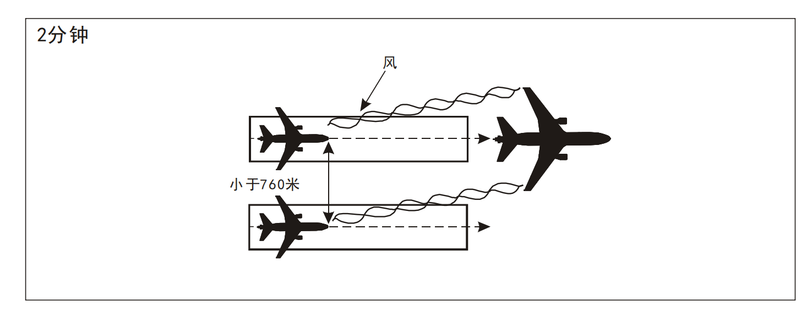
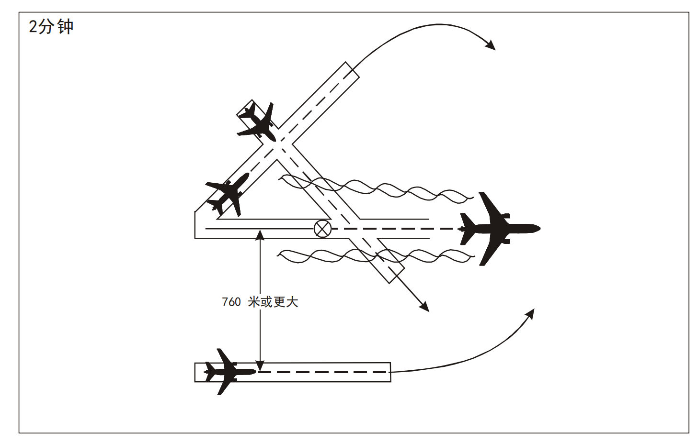
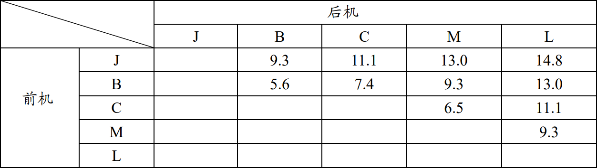

# 航空器尾流间隔

## 1. 尾流的形成及其影响

尾流（Wake turbulence）是航空器在飞行过程中在其后部形成的气流。
尾流包括由于螺旋桨飞机的螺旋桨高速旋转而产生的滑流、飞机机翼表明由于横向流动的气流而产生的紊流、喷气发动机产生的高温喷流、机翼翼尖处产生的翼尖涡流等。

为避免尾流影响，管制员应当为航空器之间配备尾流间隔。但是在下列情况时，管制员则不需要为航空器之间配备尾流间隔：

- 按照目视飞行规则飞行的两架航空器在同一跑道先后着陆，前行着陆的航空器为重型或者中型时；
- 按照仪表飞行规则飞行做目视进近，当后随航空器已报告看到前方航空器，被指示跟随并自行保持与前方航空器的间隔时。管制员应当为上述航空器以及认为必要的其他航空器发布可能的尾流警告。当航空器驾驶员认为需要额外的间隔时，应当及时向管制员报告。

## 2. 标准分类

尾流间隔标准根据机型种类而定，本规则中航空器机型种类按航空器`最大允许起飞全重`分为下列三类：

- 重型机（H）：最大允许起飞全重等于或大于`136000千克`的航空器；
- 中型机（M）：最大允许起飞全重大于`7000千克`，`小于136000千克`的航空器；
- 轻型机（L）：最大允许起飞全重等于或小于`7000千克`的航空器。

> [!IMPORTANT]
> 当前机为 `波音 757` 时，尽管其 MTOW 属于中型，但按重型机尾流间隔执行。

## 3. 起飞非雷达尾流间隔标准

当使用下述跑道时：

- 同一跑道；述航空器在进行训（熟）练飞行连续起落时，除后方航空器驾驶员能保证在高于前方航空器航径的高度以上飞行外，其尾流间隔时间应当在现行标准基础上增加1分钟。
- 平行跑道，且跑道中心线之间距离小于`760米`
  
- 交叉跑道，且后方航空器将在前方航空器的同一高度上，或者低于前方航空器且高度差小于`300米`的高度上穿越前方航空器的航迹；
- 平行跑道，跑道中心线之间距离大于`760米`，但是，后方航空器将在前方航空器的同一高度上，或者低于前方航空器且高度差小于`300米`
  的高度上穿越前方航空器的航迹。
  

则前后航空器的尾流间隔时间应当按照下列有关规定执行:

| 前机类型     | 后机类型  | 非雷达尾流间隔 |
|:---------|:------|:--------|
| 重型机      | 中型机   | 2分钟     |
| 重型机      | 轻型机   | 2分钟     |
| 中型机      | 轻型机   | 2分钟     |
| A380-800 | 其他重型机 | 2分钟     |
| A380-800 | 中型机   | 3分钟     |
| A380-800 | 轻型机   | 3分钟     |

## 4. 着陆尾流间隔标准

### 4.1 非雷达尾流间隔

当前后进近着陆的航空器在起落航线上且处于同一高度或者后随航空器低于前行航空器时，
若进行高度差小于`300米`的尾随飞行或者航迹交叉飞行，则前后航空器的尾流间隔时间应当按照下列有关规定执行：

| 前机类型     | 后机类型  | 非雷达尾流间隔 |
|:---------|:------|:--------|
| 重型机      | 中型机   | 2分钟     |
| 重型机      | 轻型机   | 3分钟     |
| 中型机      | 轻型机   | 3分钟     |
| A380-800 | 其他重型机 | 2分钟     |
| A380-800 | 中型机   | 3分钟     |
| A380-800 | 轻型机   | 4分钟     |

### 4.2 雷达尾流间隔

当使用下述跑道时：

- 同一跑道，一架航空器在另一架航空器以后同高度或者在其下`300米`内飞行；
- 两架航空器使用同一跑道或者中心线间隔小于`760米`的平行跑道；
- 交叉跑道，一架航空器在另一架航空器后以同高度或者在其下`300米`内穿越。

前后起飞离场或者前后进近的航空器，其雷达尾流间隔标准应当按照下列有关规定执行：

| 前机类型     | 后机类型  | 雷达尾流间隔 |
|:---------|:------|:-------|
| A380-800 | 其他重型机 | 11.1km |
| A380-800 | 中型机   | 13.0km |
| A380-800 | 轻型机   | 14.8km |
| 重型机      | 重型机   | 7.4km  |
| 重型机      | 中型机   | 9.3km  |
| 重型机      | 轻型机   | 11.1km |
| 中型机      | 轻型机   | 9.3km  |

## 5. 航空器尾流重新分类

航空器尾流重新分类按航空器最大允许起飞全重和翼展分为**五类**：

- 超级重型机（J）：最大允许起飞全重等于或大于`136,000kg`，翼展等于或大于`75m`的航空器；
- 重型机（B）：最大允许起飞全重等于或大于`136,000kg`，翼展等于或大于`54m`、小于`75m`的 航空器；
- 一般重型机（C）：最大允许起飞全重等于或大于`136,000kg`，翼展小于`54m`的航空器；
- 中型机（M）：最大允许起飞全重大于`7,000kg`，小于`136,000kg`的航空器。
- 轻型机（L）：最大允许起飞全重等于或小于`7,000kg`的航空器；

> [!IMPORTANT]
> B757‑200/‑300 在 `RECAT‑CN` 中归为 `中型机`，但实际尾流间隔仍须参照 `波音 757` 特殊规定。

## 6. 参考文献

1. [民用航空空中交通管理规则.中国民用航空总局.CCAR-93TM-R6](https://www.caac.gov.cn/XXGK/XXGK/MHGZ/202303/P020250811508100344431.pdf)
