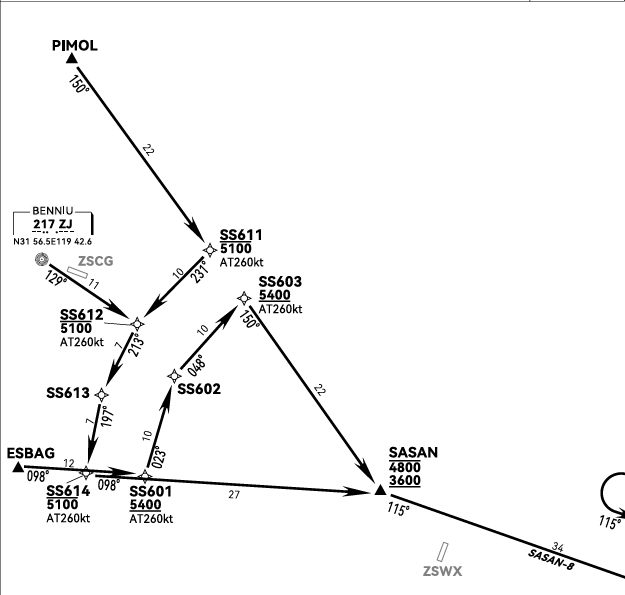
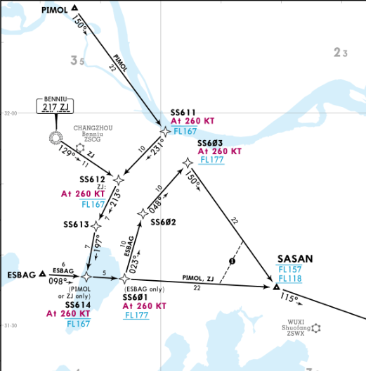
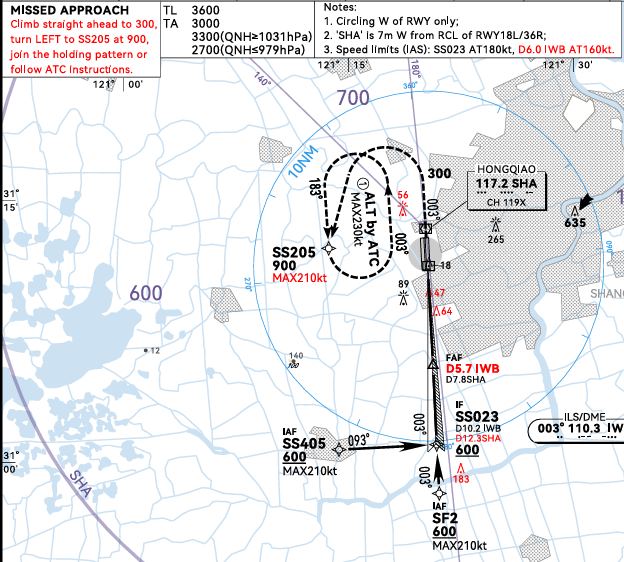
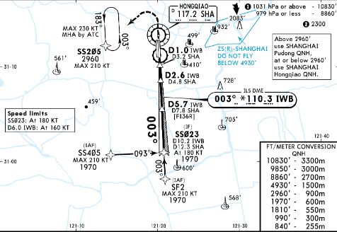
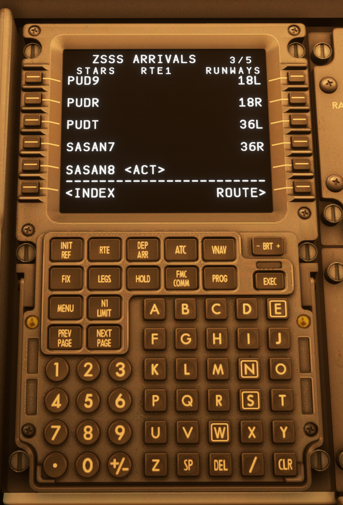
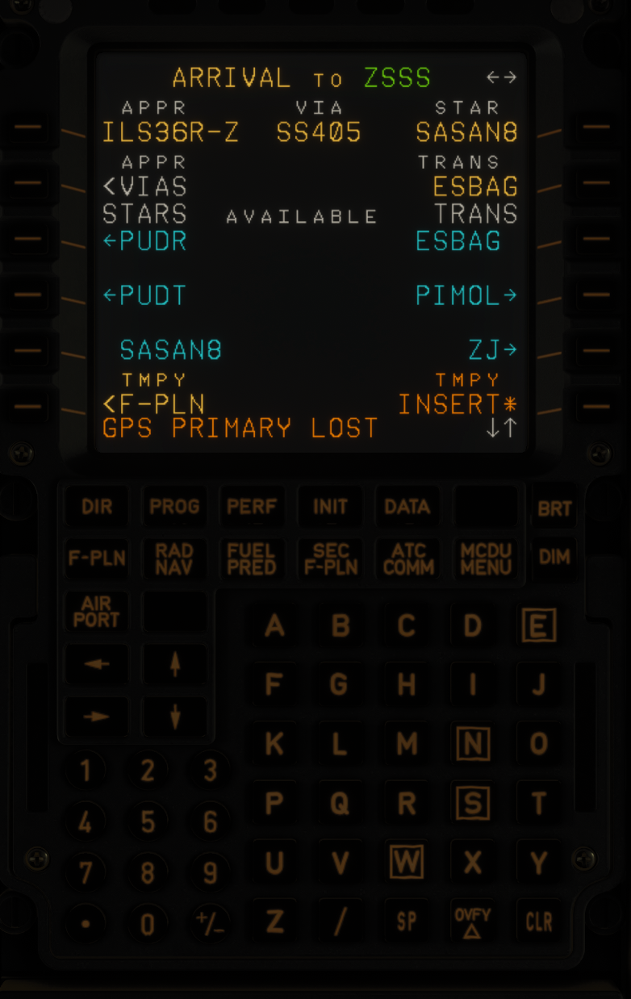

# 过渡点教程

前言

在模拟飞行连飞过程中，许多用户已经能够完成航路规划、STAR选择以及基本的进近操作。然而，在终端区阶段，过渡点（Transition / VIA）的选择仍然是一个容易被忽略的环节。

不少用户在设置 FMC/MCDU 时，会选择对应的跑道和进近方式，但没有进一步选择正确的进近过渡程序，导致航路无法完整衔接。部分情况下，可能会出现航路中断（Discontinuity）、导航路径异常，或者与管制指令不一致等问题。

过渡点（Transition / VIA）是连接不同飞行程序的重要组成部分。在模拟飞行中，正确理解并选择过渡点，可以帮助用户更准确地理解航图结构、管制意图以及飞机导航系统之间的关系，使整个进场与进近过程更加流畅。

本文档将以中国大陆常见机场程序为基础，结合模拟飞行中的实际操作场景，介绍过渡点的基本概念、航图识读方法以及波音、空客机型中的 FMC/MCDU 设置方式。

希望通过本文，帮助用户理解“为什么需要选择过渡点”、“什么时候需要选择过渡点”以及“如何正确设置过渡点”，减少连飞过程中的程序配置错误，提升终端区飞行体验。

祝各位飞行愉快！

1.认识过渡点

1.1什么是过渡点

在仪表飞行程序中，飞机会经历航路、标准仪表进场（STAR）以及仪表进近等不同阶段，而这些阶段通常对应不同的程序和航图。

由于不同程序之间需要进行衔接，因此在绝大部分机场程序中会设置过渡（Transition），用于连接不同阶段的飞行路径。

简单来说，过渡就是连接两个飞行程序的衔接部分，使飞机能够按照完整的程序路线继续飞行。

1.2过渡点在进场程序中的应用

在完成航路规划后，飞机进入机场终端区域时，通常需要依次衔接 STAR（标准仪表进场）以及对应的进近程序。

由于不同机场的航路入口、进场程序以及进近方式存在差异，STAR 和 Approach 之间并不一定能够直接连接，因此部分机场会提供过渡程序（Transition），用于完成这些程序之间的衔接。

简单来说：

航路

↓

STAR Transition

↓

STAR

↓

IAF

↓

Approach Transition / VIA

↓

进近程序

↓

跑道

其中：

* **STAR Transition**：用于连接航路与 STAR，使飞机能够从不同方向进入同一进场程序；
* **Approach Transition / VIA**：用于连接 STAR 结束位置与具体进近程序，引导飞机加入最终进近路径。

2.过渡点的分类

2.1进场过渡（STAR Transition）

由于不同航班进入终端区时的航路方向可能不同，**少数**机场会设置进场过渡，用于将来自不同方向的航路连接至对应的 STAR 程序。

例如：

航路A 航路B

↓ ↓

TRANS A(ESBAG) TRANS B(ZJ)

↓ ↓

STAR(SASAN8) STAR(SASAN8)

↓ ↓

IAF IAF

2.2进近过渡（Approach Transition/VIA）

由于不同进近方向、跑道以及进场程序的衔接方式存在差异，多数机场会设置进近过渡（Approach Transition / VIA），用于将飞机从 STAR 程序连接至对应的进近程序。

例如：

STAR

↓

IAF / VIA起始点

↓

VIA

↓

IF

↓

FAF

↓

跑道

3.航图中的过渡点识别

3.1STAR航图中的过渡点

例如在AIRAC2607的上海虹桥机场的SASAN8程序中

图表 1 eAIP-ZSSS-4P-3

图表 2 Jeppesen-ZSSS-10-2E

如上图所示，航图中列出了多个 Transition 入口。不同 Transition 对应不同的进入路径，需要根据当前航路选择对应的入口，使飞机能够正确加入 STAR 程序。

例如，航路最后一个点为**ESBAG**，而航图中提供了 **ESBAG Transition**，表示飞机将从 ESBAG 进入该 Transition，并连接至对应的 STAR 程序。

因此，在 FMC/MCDU 中选择进场程序时应选择：

* **STAR：SASAN8**
* **TRANS：ESBAG**

3.2APP进近图中的过渡点

图表 3 eAIP-ZSSS-5L-7

图表 4 Jeppesen-ZSSS-11-7

如上图所示，航图中列出了多个进近过渡（Approach Transition / VIA）入口。不同 VIA 对应不同的进入路径，需要根据当前 STAR 结束位置以及航图中的连接关系选择对应的进近过渡，使飞机能够正确加入进近程序。

例如，飞机完成 SASAN8 STAR 后，STAR 结束点为 SS405，而进近航图中标注 SS405 为 IAF，同时也是对应 VIA 的起始点，表示飞机将从该点进入对应的进近过渡，并继续执行后续进近程序。

因此，在 FMC/MCDU 中选择进近程序时应选择：

* APPR：ILS Z 36R
* VIA：SS405

4.FMC/MCDU中的过渡点设置

4.1波音机型设置

在波音机型中，过渡点通常通过 **DEP/ARR（Departure/Arrival）页面**进行选择。

完成航图确认后，需要在 FMC 中选择对应的 STAR、Transition 以及进近程序，使 FMC 航路与公布程序保持一致。

以波音737 FMC为例：

进入：

FMC → DEP/ARR

选择对应机场的到达页面。

在页面中确认：

STARS：选择对应的标准仪表进场程序；

TRANS(左侧)：选择对应的进场过渡（如有）；

APPROACH：选择对应的进近程序；

TRANS（右侧）：选择对应的进近过渡。

选择完成后，应进入 LEGS 页面检查航路连续性，确认 Transition、STAR 与进近程序之间连接正确。

4.2空客机型设置

在空客机型中，过渡点通过 **MCDU 的 ARRIVAL 页面**进行选择。

完成航图确认后，需要在在 MCDU 中选择对应的 STAR、Transition 以及进近程序，使计算机生成的航路与公布程序保持一致。

以空客 A320 系列 MCDU 为例：

进入：MCDU → F-PLN → ARRIVAL

* **APPR**：选择对应的进近跑道；
* **STARS**：选择对应的标准仪表进场程序；
* **TRANS**：选择对应的进场过渡（如有）；
* **VIA**：选择对应的进近过渡。

5.常见问题与处理

5.1“DISCONTINUITY”处理

在设置完 STAR、Transition、VIA 以及进近程序后，部分用户可能会在 FMC/MCDU 的航路页面中看到 **DISCONTINUITY**。

DISCONTINUITY 表示两个航路段之间存在程序连接间隔，并不一定代表航路错误。

出现 DISCONTINUITY 时，需要首先根据航图确认两个航段之间是否存在实际连接关系。

常见情况：

**1. 航图中存在公布连接**

如果航图显示两个程序之间应连续衔接，而 FMC 中出现 DISCONTINUITY，则需要检查：

* STAR 是否选择正确；
* TRANS 是否选择正确；
* VIA 是否选择正确。

确认程序无误后，可根据机型操作删除或连接该 DISCONTINUITY。

**2. 航图中本身没有公布连接**

如果航图没有提供两个程序之间的直接连接，则不应直接删除 DISCONTINUITY，而应等待管制指令或根据实际运行需求修改航路。

因此，处理 DISCONTINUITY 时不能只看到提示就删除，而应首先确认航图中的程序关系。

* （切勿随意删除断点）

结语

过渡点（Transition / VIA）是仪表飞行程序中连接不同程序的重要部分。在实际模拟飞行过程中，正确选择对应的 Transition 和 VIA，可以使飞机按照公布程序完成进场与进近，避免出现航点缺失、程序连接错误等问题。

在使用 FMC/MCDU 设置程序时，不应仅根据 STAR 或进近名称进行选择，而应结合实际航路、航图以及程序连接关系进行确认。

不同机场、不同跑道以及不同进近程序的设计可能存在差异，所有设置均应以当前 AIRAC 周期内的正式航图为准。

希望通过本文，能够帮助您更好地理解过渡点的作用，并在模拟飞行中正确使用 Transition / VIA，使程序设置更加准确、规范。