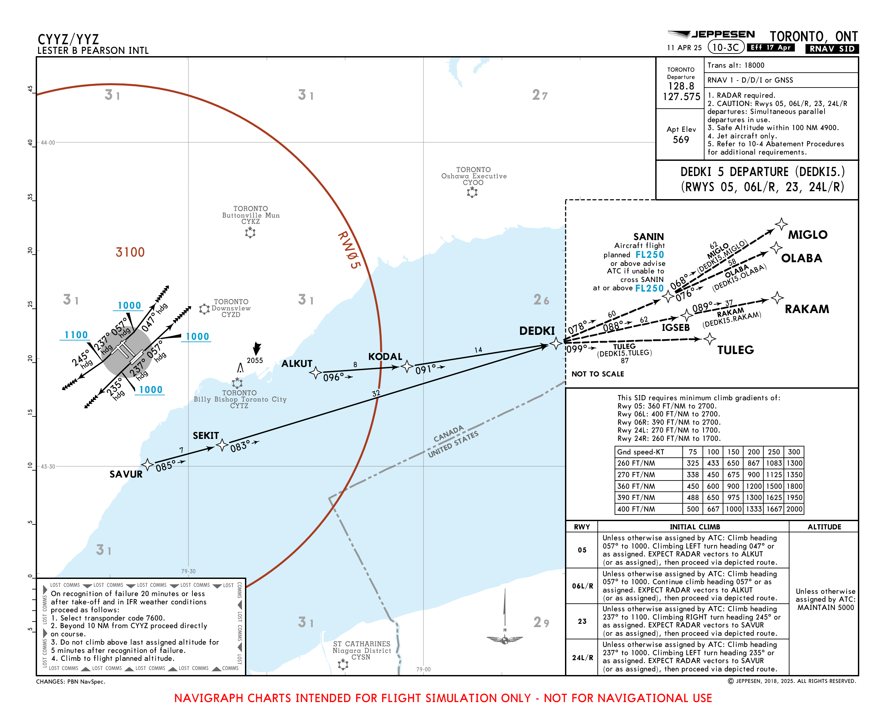
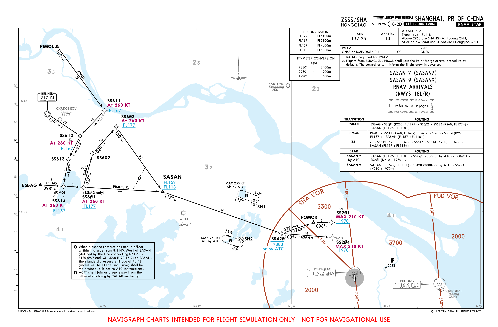
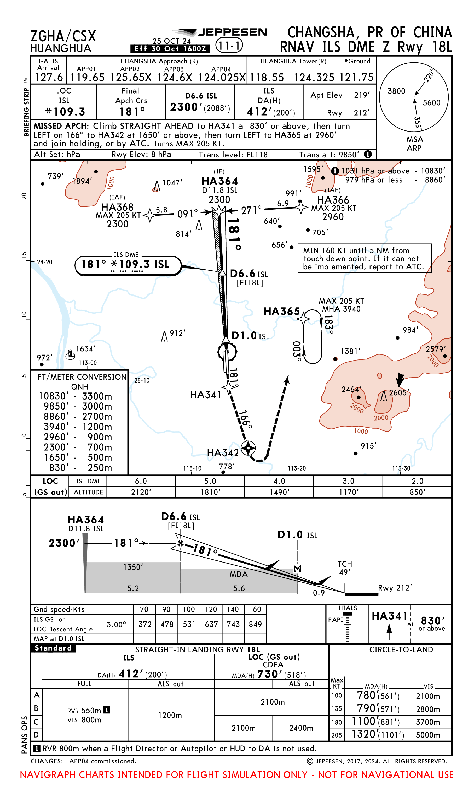
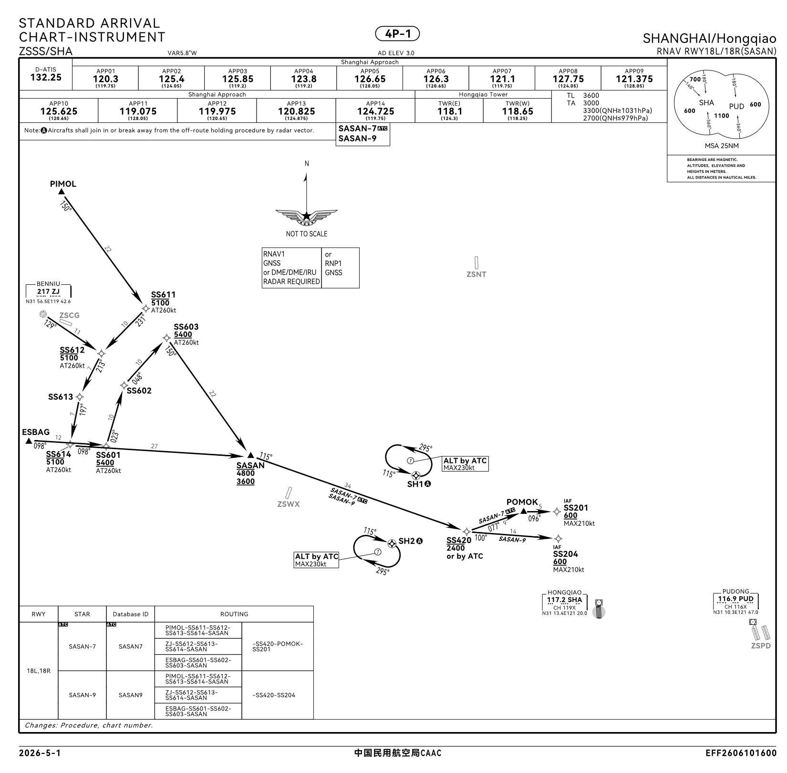
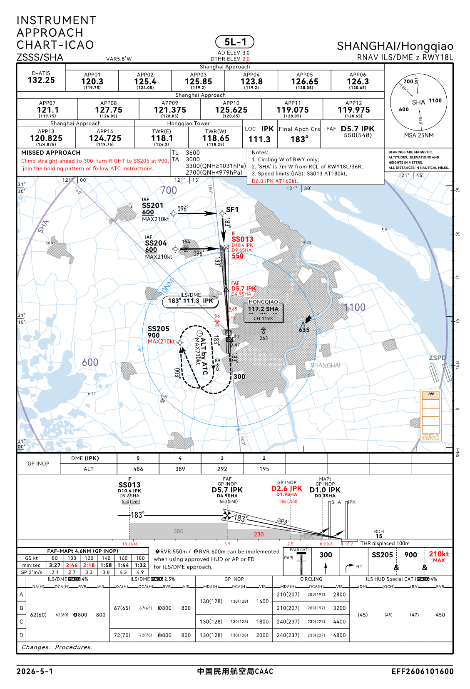
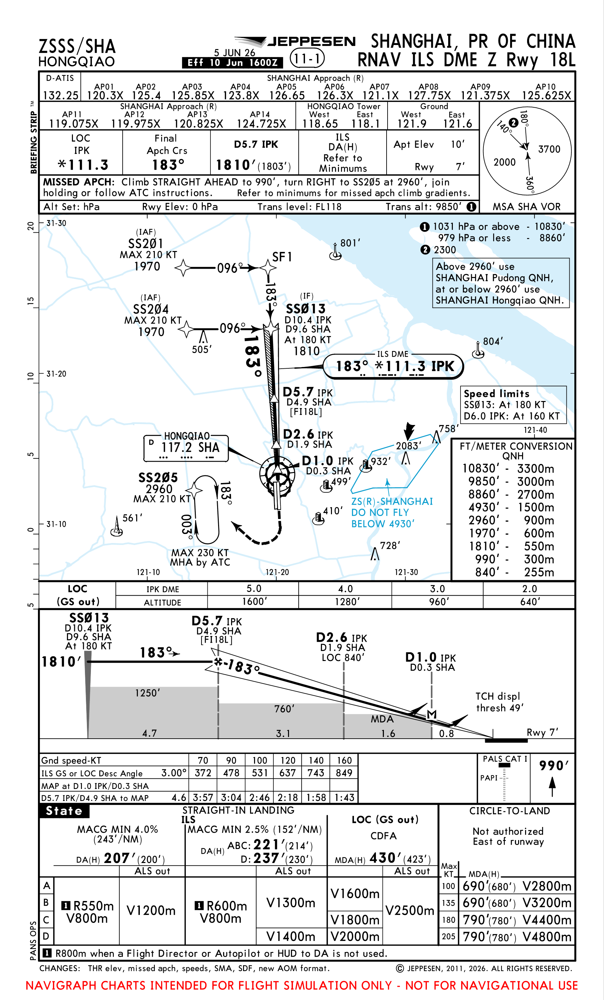
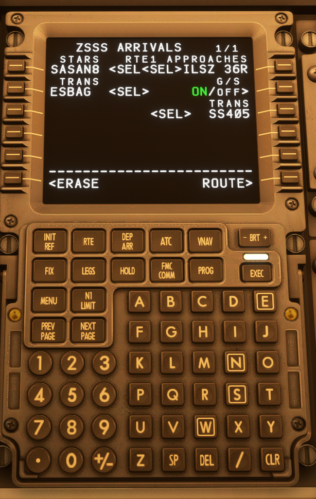
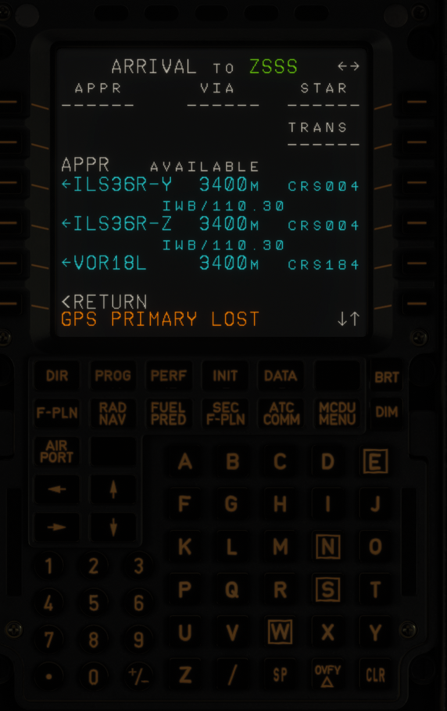

# 程序过渡点

## 前言

在模拟飞行连飞中，许多用户已能熟练完成航路规划、STAR选择及基本进近操作。
然而，终端区阶段的过渡点选择，仍是常被忽视的关键环节。

不少用户在飞行管理计算机中选定了跑道和进近方式后，未进一步配置正确的进近过渡程序，导致航路无法完整衔接。
由此可能引发航路中断、导航路径异常，甚至与管制指令不一致等问题。

过渡点是连接不同飞行程序的重要纽带。在模拟飞行中，准确理解和选择过渡点，
有助于深入把握航图结构、管制意图与飞机导航系统之间的逻辑关系，使进场与进近过程更加顺畅。

本文以中国大陆常见机场程序为背景，结合模拟飞行实际场景，系统介绍过渡点的基本概念、航图识别方法，
以及波音与空客机型的具体设置方式。

希望通过本文，帮助您厘清“为何需要过渡点”“何时选择过渡点”以及“如何正确设置过渡点”，
减少连飞中的程序配置失误，提升终端区飞行体验。

祝各位飞行愉快！

## 1. 认识过渡点

在仪表飞行程序中，飞机会依次经历标准仪表离场（`SID`）、航路飞行（`ENROUTE`）、标准仪表进场（`STAR`）和仪表进近（`APP`）等阶段。
每个阶段通常对应不同的程序和航图。由于这些程序之间并不总是直接相连，因此需要通过特定的衔接航路将其串联起来。
这段衔接航路即为`过渡段`，而`过渡段`的起点或者终点，便是`过渡点`，具体是起点还是终点取决于连接的两个阶段。
对于从`SID`到`ENROUTE`，`过渡点`指的是`过渡段`的终点；对于从`ENROUTE`到`STAR`与从`STAR`到`APP`，`过渡点`指的是`过渡段`的起点。

`过渡段`的作用在于连接前后飞行阶段，确保整条飞行路线完整、连续。

`过渡点`则通常与某个具体程序绑定出现，可视为某个具体程序的某一`过渡段`的标识或代称。

简而言之，`过渡段`连接了两个飞行阶段，使飞机能够沿完整路径顺畅飞行；而`过渡点`，则可以理解为`过渡段`的“身份证”。

## 2. 过渡分类

### 2.1 离场过渡（SID Transition）

在某些机场，离场程序并不直接延伸至航路起始点，而是先连接至某个特定航路点，
再通过离场过渡程序（`SID Transition`）分别引导飞机加入不同方向的航路结构。

以多伦多皮尔逊国际机场（CYYZ）的 `DEDKI5` 离场程序为例，如下图所示。
该程序共包含 `MIGLO`、`OLABA`、`RAKAM`、`TULEG` 与 `DEDKI` 五个离场过渡点。
飞机可根据实际飞行方向选择相应过渡路径，完成从离场到航路的平滑衔接。

### 2.2 进场过渡（STAR Transition）

由于不同航班进入终端区时的来向各异，`部分机场`会设置进场过渡程序，
用于将来自不同方向的交通流汇聚在一起，随后接入`STAR`航路。

以上海虹桥国际机场（ZSSS）的 `SASAN9` 进场程序为例，如下图所示。
该程序共包含 `PIMOL`、`ZJ` 与 `ESBAG` 三个进场过渡点。

### 2.3 进近过渡（Approach Transition）

由于进近方向、跑道以及进场程序的多样性，`几乎所有机场`都设有进近过渡程序，用于将飞机从 `STAR` 程序连接至进近程序。

以长沙黄花国际机场（ZGHA）的 `RNAV ILS DME Z RWY 18L` 进近程序为例，如下图所示。
该程序共包含 `HA366` 与 `HA368` 两个进近过渡点。

## 3. 航图中的过渡点识别

### 3.1 离场图中的过渡点

例如在多伦多皮尔逊国际机场的 `DEDKI5` 离场程序中

航图中列出了多个离场过渡段。不同离场过渡段对应不同的离场路径，
需要根据计划航路选择对应的出口，使飞机能够正确离开 `SID` 加入航路。

例如，航路第一个点为`OLABA`，而航图中提供了`OLABA Transition`，
表示飞机将从 `DEDKI` 加入离场过渡段并从 `OLABA` 离开 `SID` 加入航路。

因此，在飞行管理计算机中选择离场程序时应选择：离场程序为`DEDKI5`，过渡点为 `OLABA`

### 3.2 进场图中的过渡点

例如在上海虹桥国际机场的 `SASAN9` 进场程序程序中

航图中列出了多个进场过渡段。不同进场过渡段对应不同的进场路径，
需要根据当前航路选择对应的入口，使飞机能够正确加入 `STAR`。

例如，航路最后一个点为`ESBAG`，而航图中提供了 `ESBAG Transition`，
表示飞机将从 `ESBAG` 进入进场过渡段，并连接至对应的 `STAR` 程序。

因此，在飞行管理计算机中选择进场程序时应选择：进场程序为`SASAN9`，过渡点为`ESBAG`

### 3.3 进近图中的过渡点

如上图所示，航图中列出了多个进近过渡入口。不同进近过渡入口对应不同的进入路径，
需要根据当前 `STAR` 结束位置以及航图中的连接关系选择对应的进近过渡，使飞机能够正确加入进近程序。

例如，`SASAN9` 的最后一个点为 `SS204`，而进近图中标注 `SS204` 为 `IAF`，
同时也是进近过渡入口，表示飞机将从该点进入对应的进近过渡段，并继续执行后续进近程序。

因此，在飞行管理计算机中选择进近程序时应选择：进近程序为`ILS Z 18L`，过渡点为 `SS204`

## 4. 飞行管理计算机中的过渡点设置

### 4.1 波音机型设置

在波音机型中，过渡点通常通过 **DEP/ARR（Departure/Arrival）页面**进行选择。

完成航图确认后，需要在 FMC 中选择对应的 `STAR`、`Transition` 以及 `APPR` 进近程序，使 FMC 航路与公布程序保持一致。

以波音737 FMC为例：

按顺序点击：`DEP/ARR`

选择对应机场的到达页面。

在页面中确认：

- STARS：选择对应的标准仪表进场程序
- TRANS(左侧)：选择对应的进场过渡（如有）
- APPROACH：选择对应的进近程序
- TRANS(右侧)：选择对应的进近过渡

选择完成后，应进入 LEGS 页面检查航路连续性，确认 Transition、STAR 与进近程序之间连接正确无断点。

### 4.2 空客机型设置

在空客机型中，过渡点通过 **MCDU 的 ARRIVAL 页面**进行选择。

完成航图确认后，需要在在 MCDU 中选择对应的 STAR、Transition 以及进近程序，使计算机生成的航路与公布程序保持一致。

以空客 A320 系列 MCDU 为例：

按顺序点击：`F-PLN` → `ARRIVAL`

- APPR：选择对应的进近跑道
- STARS：选择对应的标准仪表进场程序
- TRANS：选择对应的进场过渡（如有）
- VIA：选择对应的进近过渡

## 5. 常见问题与处理

### 5.1 DISCONTINUITY

在设置完 STAR、Transition、VIA 以及进近程序后，部分用户可能会在飞行管理计算机的航路页面中看到 `DISCONTINUITY`。

`DISCONTINUITY` 表示两个航路段之间存在程序连接间隔，并**不一定**代表航路错误。

出现 `DISCONTINUITY` 时，需要首先根据航图确认两个航段之间是否存在实际连接关系。

---

如果航图中存在公布连接，而飞行管理计算机中出现 `DISCONTINUITY`，则需要检查：

- STAR 是否选择正确
- TRANS 是否选择正确
- VIA 是否选择正确

确认程序无误后，可根据机型操作删除或连接该 `DISCONTINUITY`。

---

如果航图中本身没有公布连接，则不应直接删除 `DISCONTINUITY`，而应等待管制指令或根据实际运行需求修改航路。

因此，处理 `DISCONTINUITY` 时不能只看到提示就删除，而应首先确认航图中的程序关系。

## 结语

过渡点是仪表飞行程序中连接不同程序的重要部分。在实际模拟飞行过程中，正确选择对应的过渡点，
可以使飞机按照公布程序完成进场与进近，避免出现航点缺失、程序连接错误等问题。

在使用 FMC/MCDU 设置程序时，不应仅根据 STAR 或进近名称进行选择，而应结合实际航路、航图以及程序连接关系进行确认。

不同机场、不同跑道以及不同进近程序的设计可能存在差异，所有设置均应以当前 AIRAC 周期内的正式航图为准。

希望通过本文，能够帮助您更好地理解过渡点的作用，并在模拟飞行中正确使用，使程序设置更加准确、规范。
