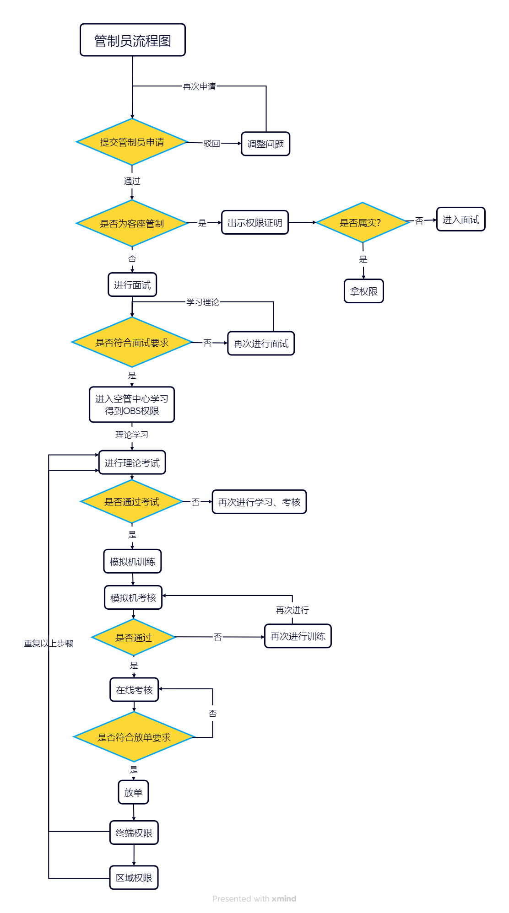
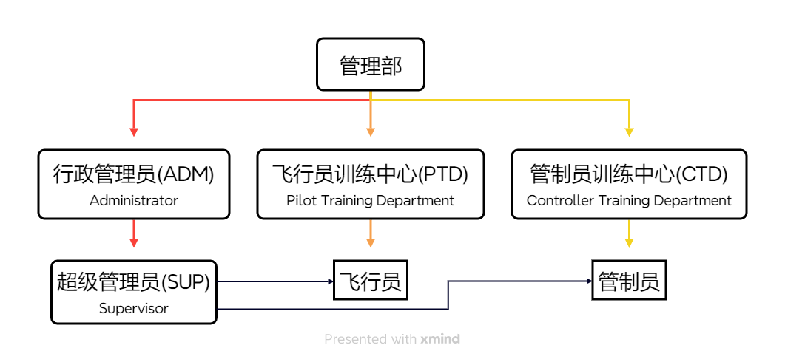

# 管制员培训大纲

## 前言

本手册是成为平台管制员的清晰指南与核心依据。

无论您是刚开始接触管制的新手学员，还是希望提升技能的进阶成员，本条例都为您指明了从观察员起步，到晋升塔台、进近、区域管制员乃至教员的完整路径。

- 明确目标：了解每一级晋升需要掌握的知识（航图、气象、对话规范）和技能（情景意识、操作软件）

- 知道学什么：您的教员在下一节课将讲解什么内容？本条例中对应的章节都有明确要求

- 理解流程：熟悉语音面试、Sweatbox考核、活动监管等关键步骤的标准

遵循指引、熟悉流程、尊重规则，是您顺利通过考核、安全高效服务的基础。
我们期待在虚拟蓝天之上，见证您的成长！

## 第一章 总则

### 1. 简介

1.1 每位管制员应将本手册的总则部分视为记忆内容，成为管制前务必查看。

1.2 本条例适用于平台内所有管制员，旨在提升管制员专业素养与应急处理能力。

1.3 本手册自发布起即刻生效，所有考核与晋升内容以此文件为依据，前序相关文件一律废止。

1.4 本规则会根据平台情况适时调整，请关注最新培训要求。

1.5 本规则最终解释权归管理组所有，任何疑问请及时反馈。

1.6 有任意两名教员或一名教员与教师在场的情况下，可不进行录音，保护学员隐私。

### 2. 训练规定

2.1 考核：

2.1.1 Sweatbox 文本符合本手册要求的架次。

2.1.2 考核在Teamspeak语音频道进行。

2.1.3 学员在有条件的情况下，需录制Playback文件（最好录制视频，用于了解学员的鼠标操作）。

2.2 主带教员对考核结果有最大和最终裁决权限。

2.3 如学员由于学习能力等其他原因，Sweatbox训练超过8次且主带教员主观认为不适合继续进行下去的，可由主带教员提出，教员团投票，一致通过的可作劝退处理。

2.4 教员必须有相应资格，必须满足以下要求：

a. 14 周岁及以上
b. 由管制员训练部批准
c. 拥有该权限的对应执照

2.5 教员对非结果性决策拥有最终决定权：例如：在ZSPD机场和ZSSS机场之间的Sweatbox文本，只要满足本手册3.1.1的要求，可以任意决定。

### 3. 定义

盒子(Sweatbox / Simulator)  - 模拟机。用于对管制员进行训练的手段，通常由操控端和训练端组成。

向下兼容(Topdown)  - 一种管制的运行模式。
> [!NOTE]
> 此提倡在尽可能的情况下其用该模式以覆盖多机场的管制。
> 默认情况下，所有席位均为Topdown模式，如该管制席位不希望运行Topdown，则应在ATC INFO中注明：
> ```
> Topdown UNAVBL.
> ```

见习(Under Mentoring)  - 正在学习管制的阶段，有一定的经验，但还未达到正式的要求。
> [!NOTE]
> 该席位的见习者需在责任教员**报备**，且有教员/教师监管的情况下，方可进行活动管制。日常在线也需要在教员监管下进行。
> Under Mentoring期间，所有在线活动应在ATC INFO中注明：
> ```
> [XX Under Mentoring] Training in progress, mentored by XXXX_I_XXX.
> ```

Solo - 能够胜任该席位的放单标准，但缺少一定的经验。
> [!NOTE]
> 每次Solo证书签至少7天，最多一次性签发14天，共计最多签发70天。
> 该席位的见习者需在责任教员**报备**，且有教员/教师监管的情况下，方可进行活动管制。但，日常在线**不需要**在教员监管下进行。
> Solo期间，所有在线活动应在ATC INFO中注明：
> ```
> [XX Solo] Certification expires on XXXX.XX.XX
> ```

教员(Instructor)  - 教授学员的人员，且可以负责考核的人员。

教师(Mentor)  - 教授学员的人员，但不可以负责考核的人员。

客座(Transfer and Visiting Controller)  - 通过一种方式，使得别的平台的管制能够以**简单**的方式加入（需符合2.14的有关规定）。

平移(Translation) - 通过一种方式，使别的平台的管制能够以**更简单**的方式加入，且负责后续权限晋升的培训工作。平台暂不接受此模式。

### 4. 附件

#### 4.1 管制权限对照表

| 权限中文名           | 英语全称                          | 缩写          | 管制范围                                       | 备注     |
|-----------------|-------------------------------|-------------|--------------------------------------------|--------|
| 观察员             | Observer                      | OBS         |                                            | 仅能进行观察 |
| 塔台管制员<br />（见习） | Student 1                     | S1          | TWR<br />Tower<br />（塔台）                   |        |
| 无               | Student 1 Solo                | S1 Solo     | TWR<br />Tower<br />（塔台）                   |        |
| 塔台管制员<br />（资深） | Student 2                     | S2          | TWR<br />Tower<br />（塔台）                   |        |
| 非雷达管制员          | Tier 2                        | T2          | Procedural<br />Tower<br />（塔台）            |        |
| 进近管制员<br />（见习） | Student 3 Under Mentoring     | S3 UM、S3 见习 | TMA<br />Termina Control Area<br />（终端）    |        |
| 无               | Student 3 Solo                | S3 Solo     | TMA<br />Termina Control Area<br />（终端）    |        |
| 进近管制员<br />（正式） | Student 3                     | S3          | TMA<br />Termina Control Area<br />（终端）    |        |
| 区域管制员<br />（见习） | Control 1<br/>Under Mentoring | C1 UM、C1 见习 | ACC<br />Area Control Centre<br />（区域管制中心） |        |
| 无               | Control 1 Solo                | C1 Solo     | ACC<br />Area Control Centre<br />（区域管制中心） |        |
| 区域管制员<br />（正式） | Control 1                     | C1          | ACC<br />Area Control Centre<br />（区域管制中心） |        |
| 区域管制员<br />（弃用） | Control 2<br/>（弃用）            | C2<br/>（弃用） |                                            | 弃用     |
| 区域管制员<br />（资深） | Control 3                     | C3          | ACC<br/>Area Control Centre<br/>（区域管制中心）   |        |
| 塔台教员            | Instructor 1                  | I1          |                                            |        |
| 进近教员            | Instructor 2                  | I2          |                                            |        |
| 区域教员            | Instructor 3                  | I3          |                                            |        |

#### 4.2 管制室晋升示意图



#### 4.3 平台架构示意图



## 第二章 塔台管制员

塔台管制是指挥机组从五边截获盲降、跑道起飞的IFR机组，到本场飞行的VFR机组。从放行、机坪、地面开始，一步步晋升到塔台。

### 总则

#### 准入条件

- 拥有对管制工作的热爱
- 注册满48小时
- 飞行时长累计满30小时
- 24小时内**未进行**申请
- 机组的中英文陆空能力
- 了解管制员的规章制度
- 简单的Metar报文解读能力
- eAIP航图识读能力
- 了解RVSM高度层
- 了解飞行情报区及空域的运行规范

#### 理论训练

- 管制晋升流程
- SOP、Loa 的概念和内容
- TL、TA、TH 和高度表拨正程序
- 航空器设备码和分类标准
- 席位之间的配合
- 中英陆空对话
- 航空器优先级
- 平行跑道运行模式(含NTZ非侵入区)
- 换向运行的条件及时机
- 起飞尾流限制
- 机位及滑行道翼展限制
- PBN程序的使用
- 班机航路的使用和查询

#### Sweatbox 训练

塔台Sweatbox训练次数为**3~8次**。

- EuroScope的基本使用办法
- 跑道的开启方式
- 各席位的协调办法(发消息)
- 飞行计划的检查
- 标牌的及时标记(语言分类)
- 流量控制的办法
- 放行排序的注意事项
- 推出开车及滑行的指令发放时机
- 注意力的合理分配

### Student 1 Solo

#### S1 Solo 授予标准

- 得到责任教员/教师授予的Solo签发证书

### Student 1

#### S1 Sweatbox 考核标准

- 陆空对话高效、科学
- 放行效率不低于15架/小时（7.5架/半小时）
- 机组计划及时检查出错误
- 滑行机组不出现对头、危险接近等情况
- 良好的职业操守
- 有一定抗压能力

#### S1 授予标准

- 通过理论考核
- 作为OBS旁观管制员考核达10小时
- 参与至少3场Sweatbox训练

### Student 2

#### S1 在线训练 考核标准

- 同时担任地面、机坪、放行席位
- 上级进近必须在线
- 连续在线时长不得低于半小时
- 无违反“S1 Sweatbox考核标准”的行为（机组数量问题引起的效率问题除外）
- 经教员投票合格

#### S2 授予标准

- 获得“Student 1 塔台管制员（见习）”管制权限
- 通过S2在线训练考核
- S1期间上管时长累计达2小时

## 第三章 程序管制

### 准入条件

- 获得“Student 2 塔台管制员（正式）”管制权限

### 理论训练

- 一次雷达和二次雷达
- QNH和QFE
- 潜在冲突解决能力的培养
- 等待程序和堆叠程序
- 传统程序的运行方式（如：VOR、DME等）
- 进近方式的差异和选择
- 阶梯下高
- 非雷达管制的程序标准

### Sweatbox 训练

训练方式采用雷达监管下的程序管制，应**2<训练次数<5**。

- 标牌的标记方法
- 应急情况的处理
- 排序间隔的处理
- 时间汇报的时机及下一步动作

### 授予标准

- 通过理论考核
- 通过Sweatbox考核

注：Tier2权限不需要在线训练。

## 第四章 进近管制员

进近管制员管理着机场和航路区飞机的进进出出，依靠无线电话和雷达管理航空器。管制范围上接航路区，下接机场管制区。

### 总则

#### 准入条件

- 获得“Student 2 塔台管制员（正式）”管制权限

#### 理论训练

- MSA和MVA的概念
- 进近标牌的使用
- 雷达识别的使用
- 应答机识别的使用
- NOTAM的查阅
- 截获航向道的注意事项
- PMS的概念
- 目视间隔的概念
- 航空器在空中的性能差别

#### Sweatbox 训练

训练方式采用循序渐进的模式，由小流量逐步增加至大流量，应**不少于3次**。

- 移交的时机处理
- 间隔的调配
- 雷达引导的试用和时机
- 盘旋等待的使用时机
- 阶梯下高的实际运用
- 良好的宏观意识
- 航空器高度规避和速度调配

### Student 3 Under Mentoring

#### S3 Under Mentoring Sweatbox 考核标准

Sweatbox文本应含有进离场航空器，10~12架次。

- 充分利用雷达引导

- 满足最低水平及垂直间隔要求

- 充分利用机场周围的空域

- 不引导航空器进入危险区等空域

- 不出现机组飞行在过渡夹层（空间）中

- 不出现耗时间的方式使机组降落

- 不出现对头、危险接近等情况

- 良好的职业操守

- 有一定抗压能力

#### S3 Under Mentoring 授予标准

- 通过理论考核

- 参与至少3场Sweatbox训练

- 通过Sweatbox训练

注：Student 3 Under Mentoring权限不需要在线训练。

### Student 3 Solo

#### S3 Solo 授予标准

- 获得“Student 3 Under Mentoring 进近管制员（见习）”管制权限
- 得到责任教员/教师授予的Solo签发证书

### **Student 3**

#### S3 在线训练 考核标准

- 担任雷达空域机场的进近席位

- 上级区域、下级塔台必须在线

- 连续在线时长不得低于半小时

- 无违反“S3 Under Mentoring Sweatbox考核标准”的行为（机组数量问题引起的效率问题除外）

- 经教员投票合格

#### S3 授予标准

- 获得“Student 3 Under Mentoring 进近管制员（见习）”管制权限

- 通过S3在线训练考核

注：Student 3权限不需要Sweatbox考核。

## 第五章 区域管制员

### 总则

#### 准入条件

- 获得“Tier 2 非雷达管制员”管制权限

- 获得“Student 3 进近管制员（正式）”管制权限

#### 理论训练

- MEA、MORA的概念

- 常见机型的速度范围

- 空速和马赫数的合理使用时机

- 向其他席位移交的时机

- 偏置等避免冲突方案

- LID的分发时机和协调方案

- 无计划飞机的处置

#### Sweatbox 训练

区域Sweatbox训练次数为**1~5次**。

- 移交的时机处理

- 间隔的调配

- 雷达引导的试用和时机

- 盘旋等待的使用时机

- 阶梯下高的实际运用

- 良好的宏观意识

- 航空器高度规避和速度调配

### Control 1 Under Mentoring

#### C1 Under Mentoring Sweatbox 考核标准

Sweatbox文本应含有对向含有潜在冲突的航空器，**10~12架次。**

- 及时进行雷达引导或偏置解决潜在危险

- 满足最低水平及垂直间隔要求

- 充分利用周围的空域

- 不引导航空器进入危险区等空域

- 不出现对头、危险接近等情况

- 良好的职业操守

- 有一定抗压能力

#### Control 1 Under Mentoring 授予标准

- 通过理论考核

- 参与至少1场Sweatbox训练

- 通过Sweatbox考核

注：Control 1 Under Mentoring权限不需要在线训练。

### Control 1 Solo

#### C1 Solo 授予标准

- 获得“Control 1 Under Mentoring 区域管制员 （见习）”管制权限
- 得到责任教员/教师授予的Solo签发证书

### Control 1

#### C1 在线训练 考核标准

- 担任区域，且Topdown至少一个机场

- 下级其他任意机场的进近必须在线

- 连续在线时长不得低于半小时

- 无违反“Control 1 Under Mentoring Sweatbox考核标准”的行为（机组数量问题引起的效率问题除外）

- 经教员投票合格

#### C1 授予标准

- 区域上管时长累计达到50小时以上

- 获得“Control 1 Under Mentoring 区域管制员（见习）”管制权限

- 通过C1在线训练考核

注：Control 1权限不需要Sweatbox考核。

### Control 3

#### C3授予标准

- 区域上管时长累计达到100小时以上
- 获得“Control 1塔台管制员（正式）”管制权限

## 第六章 管制教员

### 总则

#### 准入条件

- 获得“Control 3 区域管制员（资深）”管制权限
- 管制时长>200小时
- 教员团体讨论通过
- 熟练掌握考核大纲
- 能够胜任各项培训任务
- 为人正直有耐心

### Instructor 1 考核标准

- 见习时长>1个月
- 给与学员足够的指导
- 指出学员存在的问题
- 熟练运用EuroScope Start Sweatbox模式
- 能够为学员进行一场模拟机训练
- 熟练塔台知识点

### Instructor 2 考核标准

- 给与学员足够的指导
- 指出学员存在的问题
- 熟练运用EuroScope的Start Sweatbox模式
- 能够为学员进行一场模拟机训练
- 熟练进近知识点

### Instructor 3 考核标准

- 给与学员足够的指导
- 指出学员存在的问题
- 熟练运用EuroScope的Start Sweatbox模式
- 能够为学员进行一场模拟机训练
- 熟练区域知识点

## 第七章 管制教师

### 总则

#### 准入条件

- 获得“Student 2 塔台管制员（正式）”管制权限
- 熟练掌握考核大纲
- 能够胜任各项培训任务
- 为人正直有耐心

### Tower Mentor 考核标准

- 给与学员足够的指导
- 指出学员存在的问题
- 熟练运用EuroScope的Start Sweatbox模式
- 能够为学员进行一场模拟机训练
- 熟练塔台知识点

### Approach Mentor 考核标准

- 给与学员足够的指导
- 指出学员存在的问题
- 熟练运用EuroScope的Start Sweatbox模式
- 能够为学员进行一场模拟机训练
- 熟练进近知识点

### Centre Mentor 考核标准

- 给与学员足够的指导
- 指出学员存在的问题
- 熟练运用EuroScope的Start Sweatbox模式
- 能够为学员进行一场模拟机训练
- 熟练区域知识点

## 第八章 监管运行

### 开放条件

- “Student 3 进近管制员（正式）”及以上
- 获得该权限30天及以上
- 在线小时在该权限累计>30小时
- 非活动时段

### 监管对象

比当前权限低一级的Under Mentoring管制员

例如：S3监管可以监管S2 Under Mentoring及以下

### 监管席位

上级监管下级，且同时在线

例如：ZBAA_APP可以监管ZBAA_TWR、ZBAA_GND、ZBAA_RMP、ZBAA_DEL

> [!Note]
> 上级需在ATC INFO填写：
> ```
> [XX] I am mentoring ZBAA_TWR.
> ```
> 下级需在ATC INFO填写：
> ```
> [XX XXXXX XXXXXXXXX] Training in progress, mentored by XXXX_XXX. 
> ```

## 参考资料

[1] [VATSIM.Globa- Controller Administration Policy (GCAP)](https://cdn.vatsim.net/policy-documents/GCAP_v1.1_Release.pdf)

[2] [VATSIM.Vatsim特殊席位表](https://vats.im/designated-positions)

[3] [百度百科.进近管制员](https://baike.baidu.com/item/进近管制员/15416825)

[4] [VATPRC.管制员课程](https://moodle.vatprc.net/course/index.php)
