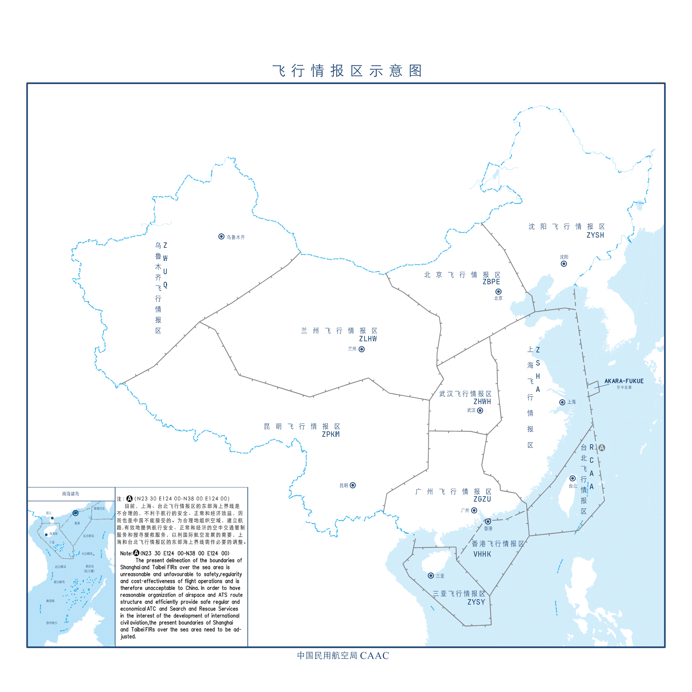

# 飞行情报区

## 中国民航飞行情报区划分示意图

## 飞行情报区定义

飞行情报区（Flight Information Region，FIR）是由国际民航组织所划定，区分各国家在该区的ATC及航空情报服务的责任区。
范围除了该国的领空外，通常还包括了邻近的公海上方空域。与防空识别区不同的是，飞行情报区主要是以ATC及飞行情报服务为主，有时因为特别的原因会切入邻国领空。

## 命名规则

飞行情报区的命名，并不以国家、省份名称命名，而以该区的飞行情报区管制中心（区管中心）所在地或区管中心的名称为命名。
例如：管制香港及澳门空域的“香港飞行情报区”、管制两广地区空域的“广州飞行情报区”、管制日本空域的“福冈飞行情报区”、管制台湾的“台北飞行情报区”等。
亦有例外情况，如厦门管制区的管制中心设于厦门市，而厦门管制区却另由上海飞行情报区管理。

## 中国民航飞行情报区

> [!NOTE]
> 中国大陆区域内的民用航空空中管理工作均由中国民用航空局管理，中国民用航空局各地区管理局负责监督管理本辖区民用航空空中交通管理工作。

| 飞行情报区     | 英文全程          | 缩写   | 管理机构      |
|-----------|---------------|------|-----------|
| 北京飞行情报区   | Beijing FIR   | ZBPE | 华北空中交通管理局 |
| 沈阳飞行情报区   | Shenyang FIR  | ZYSH | 东北空中交通管理局 |
| 上海飞行情报区   | Shanghai FIR  | ZSHA | 华东空中交通管理局 |
| 武汉飞行情报区   | Wuhan FIR     | ZHWH | 中南空中交通管理局 |
| 广州飞行情报区   | Guangzhou FIR | ZGZU | 中南空中交通管理局 |
| 三亚飞行情报区   | Sanya FIR     | ZJSA | 中南空中交通管理局 |
| 昆明飞行情报区   | Kunming FIR   | ZPKM | 西南空中交通管理局 |
| 兰州飞行情报区   | Lanzhou FIR   | ZLHW | 西北空中交通管理局 |
| 乌鲁木齐飞行情报区 | Urumqi FIR    | ZWUQ | 新疆空中交通管理局 |
| 香港飞行情报区   | Hongkong FIR  | VHHK | 香港民航处     |
| 台北飞行情报区   | Taipei FIR    | RCAA | 未查询到公开资料  |

## 参考文献

[1] [VATPRC.飞行情报区](https://www.vatprc.net/zh-cn/airspace/fir)

[2] [维基百科.飞行情报区](https://zh.wikipedia.org/wiki/%E9%A3%9B%E8%88%AA%E6%83%85%E5%A0%B1%E5%8D%80#%E4%B8%AD%E5%8D%8E%E4%BA%BA%E6%B0%91%E5%85%B1%E5%92%8C%E5%9B%BD)

[3] [维基百科.中华人民共和国飞行情报区](https://zh.wikipedia.org/wiki/%E4%B8%AD%E5%8D%8E%E4%BA%BA%E6%B0%91%E5%85%B1%E5%92%8C%E5%9B%BD%E9%A3%9E%E8%A1%8C%E6%83%85%E6%8A%A5%E5%8C%BA)

