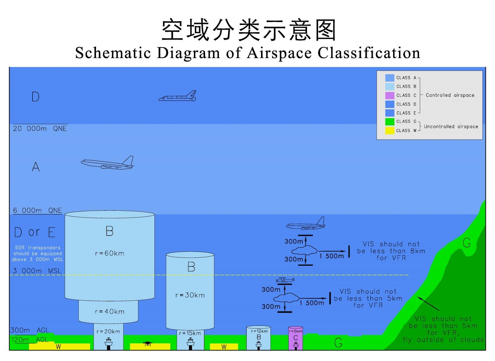

# 空域

## 空域分类示意图

## 空域分类区别速览表

> [!NOTE]
> 图例：IFR=仪表飞行规则；VFR=目视飞行规则；应答机=二次雷达应答机/同等性能监视设备

| 对比维度       | **A类**                       | **B类**             | **C类**                  | **D类**                             | **E类**                   | **G类**                      | **W类**           |
|:-----------|:-----------------------------|:-------------------|:------------------------|:-----------------------------------|:-------------------------|:----------------------------|:-----------------|
| **划设范围**   | 气压高度 6000m ~ 20000m | 运输机场上空 （多环阶梯结构） | 通用机场上空 （半径5km，高600m） | 气压高度>20000m 或指定区域               | A/B/C/G类之外 可选划设区域     | B/C外真高<300m； 或<6000m无影响区 | G类空域内 真高<120m |
| **空管服务**   | 管制 + 配备间隔                    | 管制 + 配备间隔          | 管制 （间隔配备+信息提供）       | 管制 （间隔配备+信息提供）                  | 仅**仪表飞行**管制 （目视仅提供信息） | 仅**飞行信息服务** （无管制服务）      | 无（无人机专用）         |
| **允许飞行规则** | 仅IFR （可特殊批准VFR）           | 仅IFR               | IFR / VFR               | IFR / VFR                          | IFR / VFR                | IFR / VFR                   | 微型/轻/小型无人机       |
| **通信要求**   | 双向                           | 双向                 | 双向                      | 双向                                 | IFR：双向； VFR：守听频率      | IFR：双向； VFR：守听频率         | 广播式自动发送识别        |
| **监视设备**   | 应答机                          | 应答机                | 应答机 或可被监视设备          | **>3000m**：应答机 **<3000m**：可监视设备 | 同D类                      | 安装或携带 可被监视设备             | 自动发送识别           |
| **进入许可**   | 审批 + 获批许可                    | 审批 + 获批许可          | 审批 + 获批许可               | 审批 + 获批许可 （所有飞行）                | IFR：审批+许可； VFR：报告+守听  | 报备飞行计划                      | 小型无人机 需操控员执照  |
| **速度限制**   | 无特殊限制                        | 无特殊限制              | VFR ≤ 450km/h           | ≤ 450km/h                          | ≤ 450km/h                | ≤ 450km/h                   | 无特殊限制            |

---

### 目视飞行气象条件（VFR最低标准）

| 飞行高度                        | 能见度    | 距云水平距离   | 距云垂直距离  |
|:----------------------------|:-------|:---------|:--------|
| **平均海平面 ≥ 3000m**           | ≥ 8 km | ≥ 1500 m | ≥ 300 m |
| **900m（或真高300m取高值）~ 3000m** | ≥ 5 km | ≥ 1500 m | ≥ 300 m |
| **＜ 900m（或真高300m取高值）**      | ≥ 5 km | 云外飞行     | 云外飞行    |

## 空域定义

根据航空器飞行规则、性能要求、空域环境及空管服务内容等要素，将空域划分为A、B、C、D、E、G、W共七类。
其中，A、B、C、D、E类为管制空域，G、W类为非管制空域。

---

### A类空域

**划设范围**：标准气压高度6000米（含）至20000米（含）。

**服务内容**：为所有飞行提供空中交通管制服务，并配备间隔。

**飞行要求**：

- 通常仅允许仪表飞行；
- 须保持与空中交通管理部门的持续双向无线电通信；
- 须安装二次雷达应答机或同等性能的监视设备；
- 飞行计划须经审批，进入空域前须获得空中交通管理部门许可；
- 驾驶员须具备仪表飞行能力及相应资质。

---

### B类空域

**划设范围**：划设在民用运输机场上空。

具体划设标准如下：

| 机场类型     | 划设结构                 | 高度范围                                             |
|----------|----------------------|--------------------------------------------------|
| 三跑道（含）以上 | 半径20km、40km、60km三环阶梯 | 道面—机场标高以上900m（含）；900m—1800m（含）；1800m—标准气压高度6000m |
| 双跑道      | 半径15km、30km双环阶梯      | 道面—机场标高以上600m（含）；600m—3600m（含），顶层最高至A类空域下限       |
| 单跑道      | 半径12km单环             | 道面—机场标高以上600m（含）                                 |

**服务内容**：为所有飞行提供空中交通管制服务，并配备间隔。

**飞行要求**：（同A类空域）

---

### C类空域

**划设范围**：划设在建有塔台的通用航空机场上空，通常为半径5千米、跑道道面至机场标高以上600米（含）的单环结构。

**服务内容**：为所有飞行提供空中交通管制服务。

- 为仪表与仪表、仪表与目视飞行之间配备间隔；
- 为目视与目视飞行之间提供交通信息，并根据要求提供避让建议。

**飞行要求**：

- 允许仪表飞行和目视飞行；
- 平均海平面高度3000米以下时，目视飞行指示空速不大于450千米/小时；
- 须保持与空中交通管理部门的持续双向无线电通信；
- 须安装二次雷达应答机或其他可被监视的设备；
- 飞行计划须经审批，进入空域前须获得空中交通管理部门许可；
- 驾驶员须具备仪表或目视飞行能力及相应资质。

---

### D类空域 与 E类空域

**划设范围**：

- 标准气压高度20000米以上为D类空域；
- A、B、C、G类空域以外区域，可根据运行需求和安全要求选择划设为D类或E类空域。

**服务内容**：

| 空域类别   | 服务内容                                                                       |
|--------|----------------------------------------------------------------------------|
| **D类** | 为所有飞行提供空中交通管制服务：为仪表飞行之间配备间隔；为仪表飞行提供目视飞行的交通信息及避让建议；为目视飞行提供仪表及目视飞行的交通信息及避让建议 |
| **E类** | 仅为仪表飞行提供空中交通管制服务：为仪表飞行之间配备间隔；尽可能为仪表飞行提供目视飞行的交通信息；尽可能为目视飞行提供仪表及目视飞行的交通信息    |

**通用飞行要求**（D、E类通用）：

- 允许仪表飞行和目视飞行；
- 平均海平面高度3000米以下时，指示空速不大于450千米/小时；
- 平均海平面高度3000米以上须安装二次雷达应答机或同等性能的监视设备，3000米以下须安装其他可被监视的设备；
- 须报备飞行计划；
- 驾驶员须具备仪表或目视飞行能力及相应资质。

**特殊飞行要求**：

| 空域类别   | 特殊要求                                                 |
|--------|------------------------------------------------------|
| **D类** | 仪表飞行与目视飞行进入前均须获得空中交通管理部门许可，并保持持续双向无线电通信              |
| **E类** | 仪表飞行进入前须获得许可并保持持续双向无线电通信；目视飞行无须许可，但进入前须报告并在规定通讯频率上守听 |

---

### G类空域

**划设范围**：

- B、C类空域以外真高300米以下的空域（W类空域除外）；
- 平均海平面高度低于6000米、对民用航空公共运输飞行无影响的空域。

**服务内容**：仅提供飞行信息服务，不提供空中交通管制服务。

**飞行要求**：

- 允许仪表飞行和目视飞行；
- 平均海平面高度3000米以下时，指示空速不大于450千米/小时；
- 仪表飞行须保持与空中交通管理部门的持续双向无线电通信；目视飞行须在规定通讯频率上守听；
- 须安装或携带可被监视的设备；
- 须报备飞行计划；
- 驾驶员须具备仪表或目视飞行能力及相应资质。

---

### W类空域

**划设范围**：G类空域内真高120米以下的部分空域。

**适用范围**：微型、轻型、小型无人驾驶航空器飞行。

**飞行要求**：

- 飞行过程中须广播式自动发送识别信息；
- 小型无人驾驶航空器操控员须取得操控员执照。

## 参考资料

[1] [CAAC.国家空域基础分类方法](https://www.caac.gov.cn/XXGK/XXGK/TZTG/202312/P020231222621680839714.pdf)

[《无人驾驶航空器飞行管理暂行条例》]: https://www.gov.cn/zhengce/content/202306/content_6888799.htm