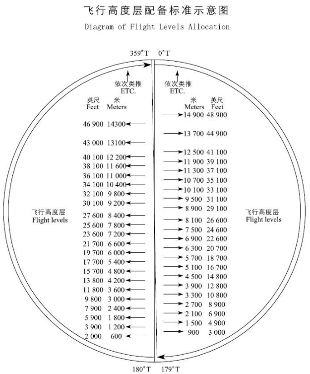

# RVSM米制飞行高度层

## 历史背景

1958年，管制空域内的标准飞行垂直间隔以高度层`FL290`为界：`FL290`以下垂直间隔为`1000英尺`，`FL290`及以上则为`2000英尺`。  
在更高高度保留更大间隔，是由于当时的气压式高度表在高空精度有限，难以确保航空器之间的安全间距。  
直至20世纪90年代，大气数据计算机、高精度高度表及自动驾驶系统等技术的发展，才使缩小垂直间隔具备了可行条件。  
为与先前2000英尺间隔的运行模式相区分，专门设立了`RVSM空域`。

#### 米制飞行高度层

中国民航采用`米制`作为飞行高度层的标准计量单位。这一惯例源于上世纪沿用的苏联民航体系，并在中国长期沿用至今。
当航空器在中国大陆空域飞行时，空中交通管制员发布的高度层指令均以`米`为单位，
飞行员应据此参照高度层配备表，在驾驶舱高度表中设置对应的`英制`高度值进行飞行。

与之相对，中国大陆以外的绝大多数国家和地区均采用`英尺`作为飞行高度层单位，在这些空域内，管制指令直接使用英尺高度层。

由于中国采用米制高度层而国际通行英尺制，两者之间存在`固定`的换算关系与取整规则。
`中国RVSM高度层`正是由国际标准英尺高度层经换算并取整为米制后形成的`固定`对应表。

**RVSM米制飞行高度层转换表**

> [!NOTE]
> 图片摘自 [China eAIP ENR 1.7.2](https://www.eaipchina.cn/e-AIP)

> [!NOTE]
> 管制员将发布米制飞行高度层指令，航空器驾驶员应根据上表确定对应的英制飞行高度层，并按英制高度层飞行。  
> 由于公英制转换存在取整差异，驾驶舱仪表显示的米制读数与管制指令的米制高度未必完全一致，但差异不会超过30米。

## RVSM定义

`RVSM` 全称为 `Reduced Vertical Separation Minimum`，中文译作 `缩小最低垂直间隔`。  
在国际民航领域，`RVSM` 是指在实行缩小垂直间隔运行的空域内（即`RVSM空域`），将`FL290`至`FL410`（含）之间的垂直间隔标准由
`2000英尺`缩小至`1000英尺`。  
按照此标准从事的飞行活动，即称为 `RVSM飞行`。

## RVSM空域

在 `8900米` 至 `12500米`（对应`FL290`至`FL410`）的巡航高度区间内，飞行高度层之间的垂直间隔由 `600米` 缩小为 `300米`。
这使得该区间内的可用飞行层数从 `7层` 增加至 `13层`，显著提升了航路的通行容量。  
在RVSM空域中，所有航空器必须遵守 `东单西双` 原则：

> [!NOTE]
> 这并不意味着在RVSM空域之外就可以忽视该原则  
> `东单西双`是中国民航所有高度层配备的基本规则

- **向东飞行**（航向0°～179°）的航空器，使用 `单数` 飞行高度层；
- **向西飞行**（航向180°～359°）的航空器，使用 `双数` 飞行高度层。

这里的`单数`与`双数`是指：将米制高度层数值去掉末尾两个“0”后，所得数字的奇偶性。  
例如：8900米去掉末尾两个“0”得89，为单数；9200米得92，为双数。

## 航空器驾驶员要求

在`RVSM空域`内运行的航空器，须具备`RVSM空域运行能力`。  
在高度层转换过程中，航空器偏离指定飞行高度层的最大误差**不得超过45米（150英尺）**。  
当飞机爬升通过过度高度时，应将高度表中的气压参考设置为`标准大气压`。  
当飞机下降通过过度高度层时，应将高度表中的气压参考设置为当地`修正海压`。

## 转换空域

从`非RVSM空域`到`RVSM空域`的过渡区域，即垂直间隔由2000英尺标准转换为1000英尺RVSM标准的空域（或反向转换），称为`RVSM转换区域`。  
因天气或交通状况综合影响，当地空中交通管制可能宣布**暂时停止RVSM运行**——此时飞机垂直间隔由1000英尺恢复为2000英尺；  
当管制部门宣布**取消暂停**时，则从2000英尺恢复为1000英尺间隔。同一区域内的此类垂直间隔转换，同样属于RVSM转换区域的范畴。

## 实施时间

中国于**2007年11月22日0时**（UTC时间2007年11月21日16时）在所属空域8900米至12500米之间正式实施米制缩小垂直间隔。中国由此成为国际上第一个使用米制高度层实施缩小垂直间隔的国家。

## 参考文献

[1] [CAAC.RVSM空域运行要求](https://www.caac.gov.cn/XXGK/XXGK/GFXWJ/201801/P020180123610461292434.pdf)

[2] [CAAC.缩小垂直间隔（RVSM）空域的运行要求](https://www.caac.gov.cn/XXGK/XXGK/GFXWJ/201511/P020151103346940128611.pdf)

[3] [百度百科.RVSM空域](https://baike.baidu.com/item/RVSM%E7%A9%BA%E5%9F%9F/15731374)

[4] [VATPRC.RVSM飞行高度层分配方案](https://www.vatprc.net/zh-cn/airspace/rvsm)
