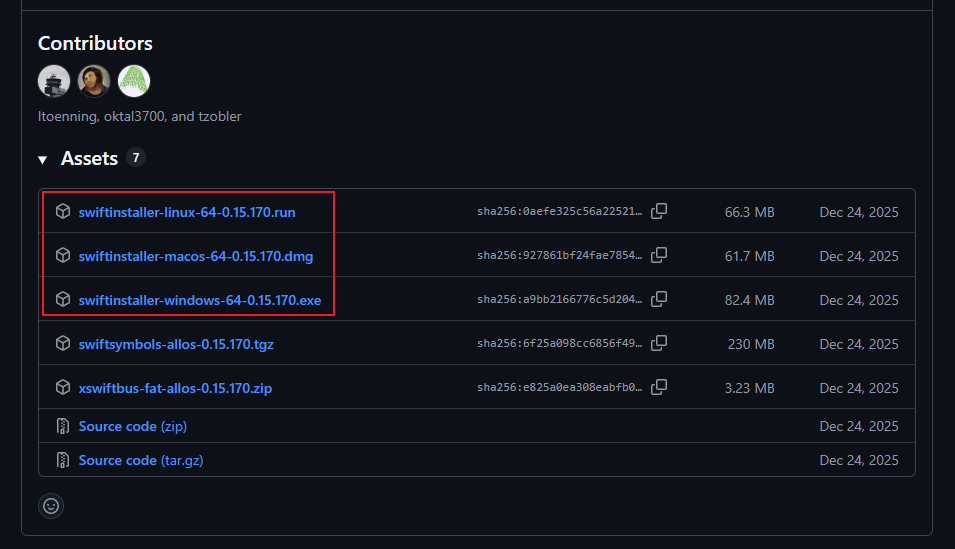
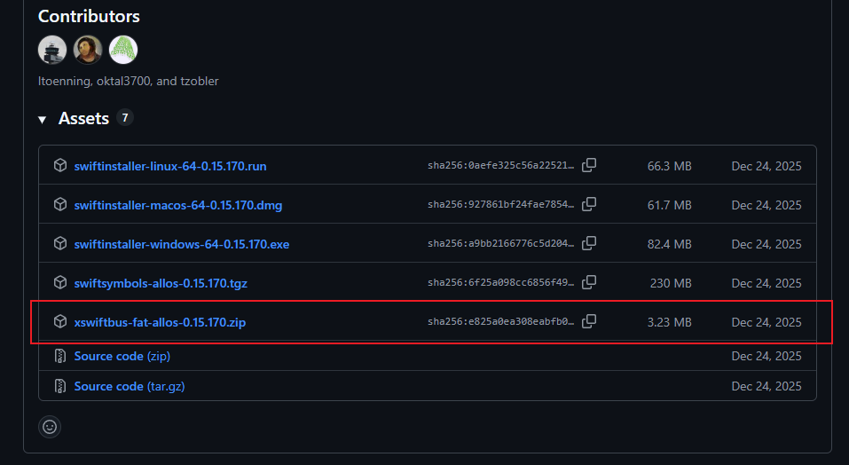
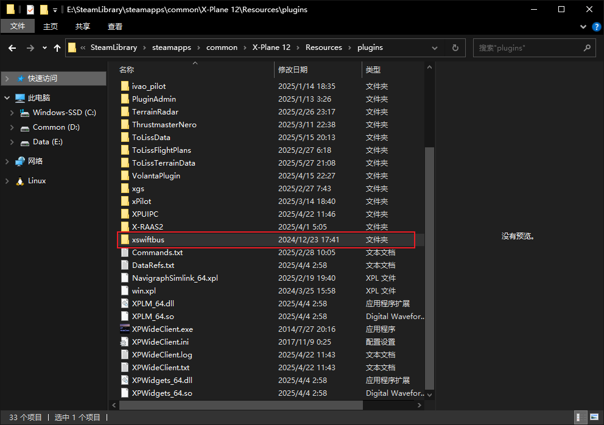

# Swift 连飞教程

## 前言

Swift官方文档地址: [https://swift-project.org](https://swift-project.org)

> swift pilot client is a multi-platform (Windows, macOS, Linux) and multi-flight simulator (X-Plane 11, X-Plane 12,
> MSFS2020, MSFS2024, P3D (64-bit), FlightGear) application for virtual pilots who would like to connect to VATSIM
> or private FSD servers.
> We are an independent (private/non-commercial) software project creating open source software for flight simulation.

Swift 功能强大，但界面相对老旧且为纯英文，不少新手用户在初次使用时感到困惑。  
本文档旨在为您提供一份清晰、实用的操作指南，从软件准备、客户端配置、服务器连接，到实际飞行操作，一步步带您完成全部流程。

我们相信，熟悉流程、遵守规则，是获得流畅、沉浸且富有成就感的联飞体验的基础。  
特别是对于新手飞行员，强烈建议您在参与连飞活动前，熟练掌握所选机型的操作，并认真阅读本指南。

无论您是第一次接触连飞，还是希望在新平台开启联飞之旅，我们都希望本文能为您带来帮助。  
现在，请跟随我们的指引，开启您的联飞旅程。期待在虚拟蓝天下与您安全、顺畅地相遇！

## 第一章 连飞软件的安装及配置

### 1 下载所需文件

#### 1.1 Swift客户端

首先，需要下载swift联飞客户端，推荐下载版本0.15.x，有两种下载方式：

1. [Swift官方下载地址](https://github.com/swift-project/pilotclient/releases)
2. [APOC下载站下载地址](https://file.apocfly.com/Swift%E7%9B%B8%E5%85%B3%E6%96%87%E4%BB%B6)

> [!NOTE]
> 如果使用Swift官方下载地址下载，可能需要一些科学上网手段

然后根据您的操作系统及**模拟器**情况，点击“Assets”下方特定版本的安装包下载

> [!NOTE]
> FSX、FS2004-FS9和P3D v1-v3的玩家需要注意  
> 只有32位的swift才支持这些模拟器，所以这些玩家需要使用32位的swift，下载时需要注意  
> 截至2026.06.15，只有**0.14.142**或更老版本提供了32位的版本

如果您是X-Plane 11/12用户，还需要下载xswiftbus，后文将再次提到

> [!CAUTION]
> 请确保xswiftbus的版本号，即**0.xx.xxx**，与您下载的swift版本号相匹配  
> 下载后将解压缩并放到XPlane根目录下的`Resources/plugins`文件夹内，注意不要有文件夹嵌套

#### 1.2 下载机模映射包

关于映射包的作用：

机模映射包对于完整的连飞体验来说是必需且必要的，虽然不同模拟飞行软件的机模映射包各不相同，但对于连飞而言，其底层逻辑逻辑是一致的，即：

- 使模拟飞行软件和swift 可以读取几乎所有主流机型的“飞机模型”（即“机模”）；
- 在游戏内添加“AI”飞机；
- 根据从连飞服务器上其他飞机的状态，同步调整“AI”飞机的状态

由此实现了将服务器上的其他飞机 “映射” 到您自己的模拟飞行软件中

所以“机模”由映射包提供，“映射”则由联飞软件提供

##### 1.2.1 MSFS 2020 映射

[swift官方关于MSFS机模映射的文档](https://swift-project.org/home/models/msfs/)

推荐使用AIG映射包

AIG映射包下载后需要手动解压到MSFS的community目录下，注意不要出现文件夹嵌套

百度网盘：[https://pan.baidu.com/s/1fBCBvSGkq6pUC6d7jYa2lA?pwd=9jkc](https://pan.baidu.com/s/1fBCBvSGkq6pUC6d7jYa2lA?pwd=9jkc)

##### 1.2.2 X-Plane 11/12 映射

[swift官方关于X-Plane机模映射的文档](https://swift-project.org/home/models/xplane/)

您可以使用官方文档中提到的X-CSL作为X-Plane的映射包，这里是X-CSL的官网：[https://x-csl.ru/downloads](https://x-csl.ru/downloads)

按照X-CSL官网提供的步骤进行下载安装即可

鉴于X-CSL的官方下载器的下载速度感人，这里给出网盘下载地址

百度网盘：[https://pan.baidu.com/s/1FdbYVhd8lucimYaXXuTmMw?pwd=hkps](https://pan.baidu.com/s/1FdbYVhd8lucimYaXXuTmMw?pwd=hkps)

123云盘：[https://www.123912.com/s/oFMGTd-Rs4gv?](https://www.123912.com/s/oFMGTd-Rs4gv?)   提取码:tZgp

下载后请解压到xplane目录的任意位置，推荐放在Custom Data文件夹下，文件名随意，但一定要在xplane的目录下，xplane无法读取目录以外的文件

##### 1.2.3 Flight Simulator X & Prepar 3D

[swift官方关于Flight Simulator X、Prepar 3D机模映射的文档](https://swift-project.org/home/models/fsx_p3d/)

官方文档也没写太多东西，只提了一嘴P3D用的是AIG映射包

### 2 安装Swift

!!! Danger

    在安装之前，请确认四件事情：
    
    - 确保关闭**所有**正在运行的swift和模拟器
    
    - swift安装包和对应的映射文件已经下载完毕
    
    - 对于X-Plane 11/12的用户：xswiftbus已正确安装并加载
    
    - 确保使用的是正确的swift32或swift64位版本

本小节以windows10 64位为例，其他操作系统大同小异

本教程假设您为第一次安装swift，如果您曾经安装过swift，则部分页面会有些许不同，请您灵活应变

1. 双击运行swift安装程序，你可能会看到如下窗口，点击“是”即可：

   

2. 点击“Next”

   

3. 点击“I accept the agreement”，然后下一步

   

4. 红框内请按照你安装的模拟器勾选，然后下一步

   

   !!! Note
   注：除了红框内的内容，不要动其他的选项。

5. 在这个页面可以自定义安装目录，建议放置在自己记得的位置。

   

   !!! Note

   	注：其他选项不要动，下一步。

6. 点击Next

   

7. 等待安装完成后，点击下一步

   

8. 随后会弹出如下页面

   

9. 请等待他初始化完成，初始化完成后会跳出如下页面：

   

10. 此时我们的swift已经安装好了，接下来要进行swift的配置

### 3 Swift配置（模型库安装）

#### 3.1 同意使用协议

勾上这两个复选框，前者表示同意使用协议，后者表示向服务器发送崩溃报告。

#### 3.2 检查数据库

在此页面您也许需要等待一些时间，来让Swift下载运行所必须的数据，当“Next”按钮亮起的时候，代表您可以继续进行下一步了，后续Swift可能会在后台继续下载一些数据。

#### 3.3 从其他版本复制模型库

如果您曾经安装过其他Swift版本，可以在此页面从其他Swift中复制模型库。

如果您是第一次安装Swift或者不需要其他版本的模型库，则可以直接进行下一步。

#### 3.4 从其他版本复制配置文件

#### 3.5 路径配置

1. 对于上方的模拟器，您飞哪个，就勾选哪个 请不要多勾选，后续您需要对每个模拟器进行模型库配置 这里我们以X-Plane为例（其他模拟器操作类似）

   

2. 首先，需要检查模拟器路径（第一行）和模型库路径（第二行）是否正确， 如果swift没有正确识别，需要点击对应的右侧按钮，手动选择目录

   

3. 对于其他模拟器，同理 检查无误后，点击save按钮后，进入下一步 （如果有多个模拟器，请全部检查完成并save后再进入下一步）

   

#### 3.6 创建模型库

这里同样以X-Plane为例：

1. 首先，需要在左侧选择对应的模拟器平台，在这里我们选择X-Plane 然后，注意力来到右侧的models选项卡 第一行，是模型库路径，这里再次检查一下是否正确

   

2. 然后，点击第二行的display按钮，会弹出如下窗口：

   

我们点击force reload，耐心等等他重新加载完。

#### 3.7 X-CSL映射

1. 如果您是用的X-CSL官方的下载器下载的，那么会显示报错。

   

2. 此时我们关掉该报错窗口，然后在任意一个模型上右键：

   ->simulator

   ->Xplane:run CSL2XSB on all models

   

3. 此时会打开一个黑窗口。

   我们键入y并且回车，等他输出完成后，关掉该窗口。

   

4. 我们重新force reload一遍。

   

若一切正常，则您可以看到如上窗口

5. 此时我们关闭最上面的两个窗口，点击create按钮

   

6. 对于第一个跳出来的窗口，选择Yes

   

7. 如果之前有创建过模型库，会有第二个窗口，我们同样选择yes

   如果之前没有创建过模型库，则不会有第二个窗口弹出

   

8. 在最后弹出的窗口中，我们点击右下角的save ‘XPlane’

   

9. 出现左图的窗口时，说明swift正在保存模型库，需要耐心等待

   

10. 当该窗口自主消失的时候，说明模型库创建成功，我们可以关掉最上层的窗口

    随后检查一下模型数量，一般来说这个数字是越大越好

    

11. 对所有模拟器平台都完成上述操作并创建完模型库后，我们进入下一步

    

#### 3.7 安装xswifbus（仅X-Plane玩家）

由于我们在准备阶段就已经安装完成，所以这里不需要动任何东西，直接进行下一步

如果没有安装，可以点击[这里](#11-swift)再次阅读

#### 3.8 配置快捷键

这里用来配置swift的快捷键，包括PTT等，但由于本平台不使用swift内置的语音，所以该页面可以直接跳过

至此我们的swift模型库就配置完成了

### 4 服务器配置

1. 点击GUI按钮；或者双击安装目录下swiftguistd.exe ，打开swiftgui页面；

   

   

   下图所示是swift的主页面：

   

2. 我们点击Settings->Server

   

   

4. 在下方填写如下信息：

   

   | 名称        | 左填空栏                                  | 右填空栏       |
                                             	| ----------- | ----------------------------------------- | -------------- |
   | Name/desc.  | 该服务器显示的名字，可以任意填写          | 服务器的描述   |
   | Eco./type   | FSD (private)                             | FSD (legacy)   |
   | Addr./port  | fsd.apocfly.com                           | 6809           |
   | Real name   | 自己的昵称 |                |
   | Id/password | 登录飞控的呼号                            | 登录飞控的密码 |

   !!! Note

   	根据[CoC 2.9](../../General/OPDOC-General-202502-R2-SC/?h=%E5%90%88%E7%90%86%E7%9A%84%E5%90%8D%E7%A7%B0#_5)有关规定您必须在Real name，填写以下中一项：
   	 
   	- 注册CID
   	
   	- 注册昵称
   	
   	- 注册邮箱

3. 全部填写完成后，点击右下角save

   

### 5 swift使用说明

下面为swift的主界面，我们仅对几个经常用到的功能做详细说明

#### 5.1 Connect页面

该页面是用于连接服务器的页面
Swift 版本不同该页面可能会有些许不同，但操作逻辑相同

- 检查上方Network 选项框，选择Other Servers

- 下面选择APOC服务器

- Login这里需要检查是否是Normal位置，如果不是，检查模拟器启动是否正常

---

- 下方的Pilot Info，检查无误即可

- Home这里可以填你的基地机场，选一个自己喜欢的机场ICAO码填进去就行

---

- 最后一个区域，需要检查Callsign 是否正确

- Aircraft 是否是自己执飞的机型

- Airline 是否是自己执飞的航司

- 全部检查无误以后点击Connect 连接

---

当显示该页面的并且左下角变成绿色，代表你已经连接成功
!!! Warning

    警告：请不要在跑道/滑行道上出生，这是违反[CoC 3.6](../../General/OPDOC-General-202502-R2-SC.md?h=%E4%B8%8D%E5%BE%97%E5%9C%A8%E7%83%AD%E5%8C%BA%E8%BF%9B%E8%A1%8C%E8%BF%9E%E7%BA%BF#_6)的违规行为

#### 5.2 飞行计划页面

!!! Note

    注：如果您对此部分感到困惑，不妨试试我们的网页提交计划功能，[点此进入](https://www.apocfly.com/flight-plan)
        
    !!! Note
    
        此功能仅限[APOC模拟飞行平台](https://www.apocfly.com)使用

点击`Flight pl.`进入飞行计划页面，界面如下：

---

飞行计划填写的顺序是，自左向右，自上而下填写，如下图所示：

解析如下：

1 Type：飞行类型，一般我们航线飞行选择IFR即可
2 Callsign：航班呼号，在上面连接的时候填写，这里无法修改
3 Aircraft：飞机的ICAO 识别码，swift自动填写，一般不用动
4 Wake Turbulence Category：尾流类型，swift自动填写，一般不用动

---

5 NAV/COM Equipment：导航和通讯设备代码，表明飞机的导航和通讯能力，如果不知道填什么，可以不用动

6 SSR Equipment：二次雷达代码，表明飞机的二次雷达设备能力，如果不知道填什么，可以不用动

7 TAS：计划飞行的真空速，如果不知道数值，可以不填，也可以填一个经验值（400-450）

---

8 Departure airport：离场机场，填写离场机场的ICAO码

9 Departure time：计划离场时间，UTC时间，不了解可以不用管

10 Cruising altitude：计划巡航高度，以英尺作为单位，如果飞国内航线需注意米制转换

---

11 Route：计划航路

---

12 Destination airport：到达机场，填写到达机场的ICAO码

13 Est.time enroute：计划航路时间，计划的飞行时间，不清楚可以不填

14 Fuel on board：机载燃油的飞行时间，不清楚可以不填

16 Alternate Airport：备降机场，填写备降机场的ICAO码，没有备降场可以不填

17 remarks：备注信息，备注信息右侧的下拉框表示交流类型；

- Full voice 表示可以接受双向语音管制；

- Receive vioce 表示只能单向接受语音管制；

- Text only 表示只能接受双向文字管制；

!!! Note

    注：在管制空域内，此处提交的内容只需要提交一次，若您认为飞行计划有问题或管制员告知您的飞行计划有误时，您仅需要在您的飞机上进行更改，而您的计划，管制员会帮忙进行更改。
    !!! Note
    
        此功能仅限[APOC模拟飞行平台](https://www.apocfly.com)使用

---

确认所有内容填写正确后，点击Send 按钮发送飞行计划到服务器（若不放心您也可以多点几下）

出现下方窗口代表发送成功

#### 5.3 消息界面

!!! Note

    如果您收到了此消息：
    
    
    
    那么证明您的计划已经在网页提交了，但是本次飞行的航班呼号和网页提交的不同，请您回至[connect页面](#51-connect)重新检查
    !!! Note
        此功能仅限[APOC模拟飞行平台](https://www.apocfly.com)使用

---

这里主要用于与管制员的文字交流

先点击Message to，在选择要发送到的管制席位

最后在下面Message 中输入内容，随后按下回车，即可发送消息

如果要在频道内发送消息，则点击上方COM1 或者COM2

在下方输入框中输入消息，回车发送即可

#### 5.4 ATC页面

用于查看周围在线的管制员

#### 5.5 Radar页面

用于查看周围的机组

#### 5.6 Aircraft页面

同样可以查看周围的机组，不过是以列表形式展现

### 6 联飞说明

**不要使用**不熟悉的机模进行连飞活动！

**不要使用**不熟悉的机模进行连飞活动！！

**不要使用**不熟悉的机模进行连飞活动！！！

- 不熟悉指：无法熟练使用自动驾驶或其他机载设备，准确无误的完成管制员的指令，并在管制员询问飞机状态时准确无误的回答

所以，参加连飞活动请务必、一定、必须使用自己熟悉的机模

这**不仅仅**保障了你有一个良好的活动体验，也同时保障了其他活动参与者和管制员的活动体验

## 后记

连飞从来不仅是一场飞行模拟，更是一段人与人之间的协作与交流体验。

无论您是第一次踏入虚拟蓝天的新飞行员，还是已在各大网络飞行平台积累了丰富经验的资深机长，我们都希望本指南能为您带来清晰的方向与可靠的参考，帮助您更加顺利地融入联飞环境。

航空是一门严谨的学科，联飞亦然。规范、沟通、尊重与默契，是让每一次联飞变得愉快而富有成就感的关键。请记住：您的每一份准备、每一次遵守流程、每一次与他人的有效协作，都是让天空更加有序与和谐的重要力量。

若您在阅读本教程的过程中遇到疑问、发现疏漏、或愿意贡献改进内容，我们诚挚欢迎您提出建议。您的反馈将使本教程不断完善，也能帮助更多飞行员收获更好的联飞体验。

愿我们在无线电中相遇，在航迹上并肩，在虚拟的天空里，共同飞得更高、更远。

期待在下一次的联飞活动中，与您在空中相见。

## 参考资料

[1] [Swift.文档站](https://swift-project.org/)