# TeamSpeak 使用教程

## 下载方式

### TeanSpeak 3 本体

> [!Warning]
> 请勿从从 **TS中文网** 下载 TeamSpeak3，[查看原因](https://teamspeak.app/docs/advanced/why-not-ts-cn/)。

下载链接

- [APOCFLY网盘](https://file.apocfly.com/%E8%BF%9E%E9%A3%9E%E8%BD%AF%E4%BB%B6/TeamSpeak3-Client-win64-3.6.2.exe)
- [官方直链](https://files.teamspeak-services.com/releases/client/3.6.2/TeamSpeak3-Client-win64-3.6.2.exe)

SHA256: `eab9e0c1a7134643e5f7116b7e0e58faffb20d6db528f8b333d2c2b5d1ab68ae`

### TeamSpeak 3 汉化包

下载链接

- [APOCFLY网盘](https://file.apocfly.com/%E8%BF%9E%E9%A3%9E%E8%BD%AF%E4%BB%B6/Chinese_Translation_zh-CN_%E4%B8%AD%E6%96%87%E7%BF%BB%E8%AF%91%E5%8C%85.ts3_translation)
- [官方直链](https://dl.tmspk.wiki/https:/github.com/VigorousPro/TS3-Translation_zh-CN/releases/download/snapshot/Chinese_Translation_zh-CN.ts3_translation)

SHA256: `3f9613c18ec108c159af6ed372e6b658dd5c7b223902d23951fe35bfdf8bac40`

## 正式安装

> [!NOTE]
> 本教程以TeamSpeak3-Client-win64-3.6.1为素材制作。

1. 打开"TeamSpeak3-Client-win64-3.6.1.exe"

   
   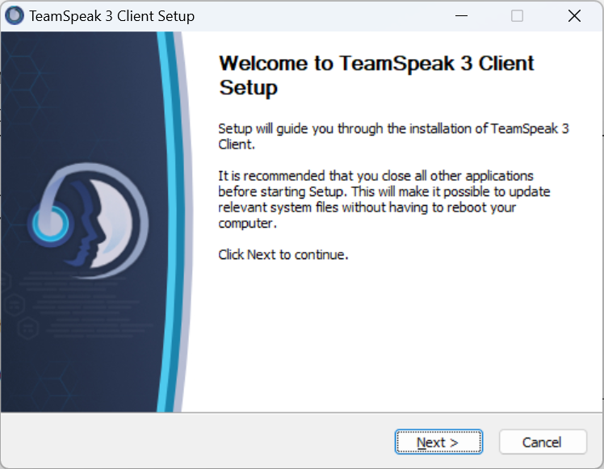

2. 划到最底下，同意协议

   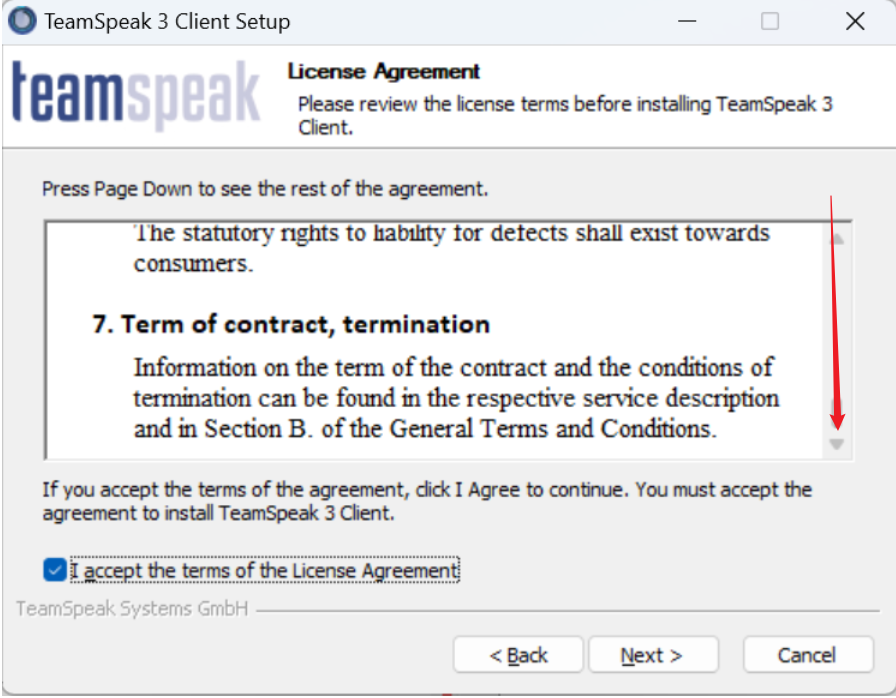

3. 选择安装用户，默认即可

   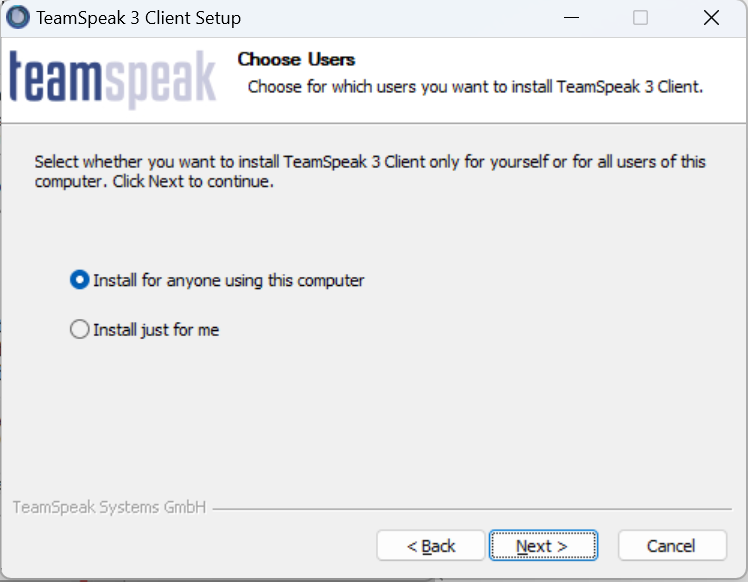

4. 选择安装目录，默认即可

   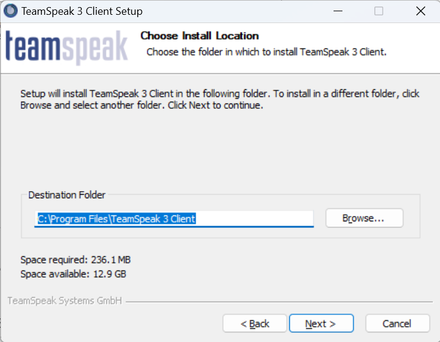
   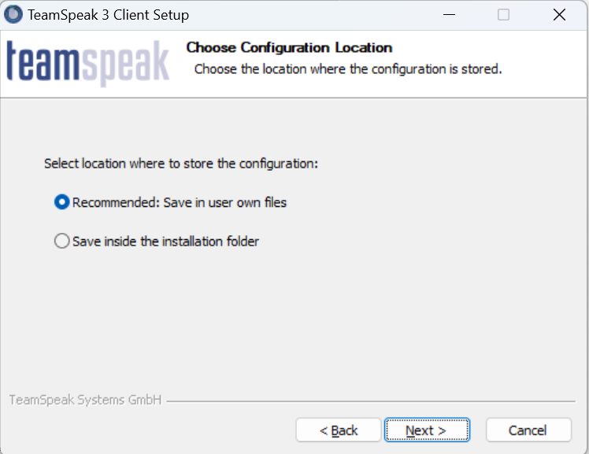
   
   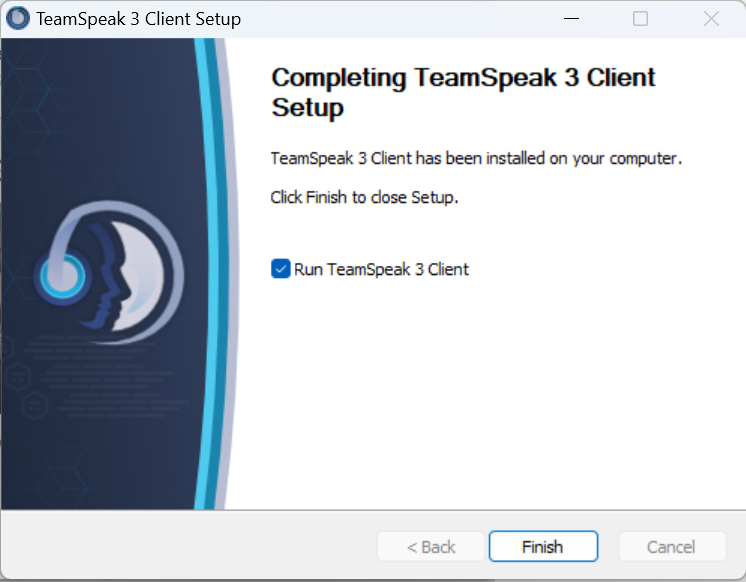

5. 完成安装，弹出以下界面并关闭

   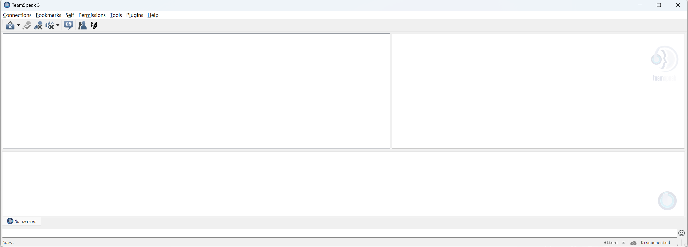

---

接下来安装汉化

1. 打开"Chinese_Translation_zh-CN.ts3_translation"

   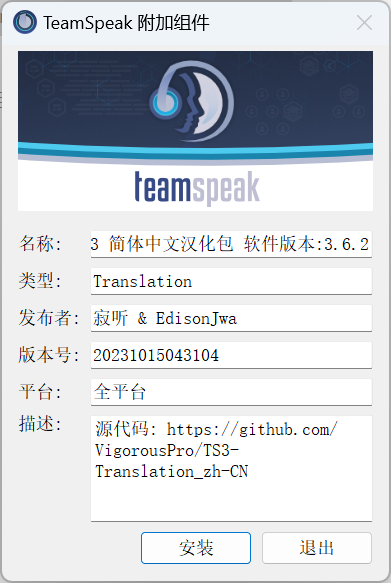

2. 启用汉化

   

3. 安装成功

   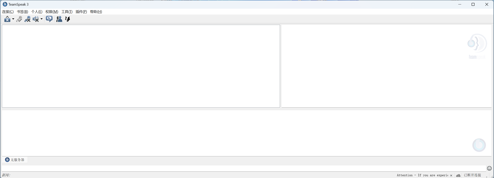

## 使用方法

1. 点击 `连接 -> 连接至服务器`

   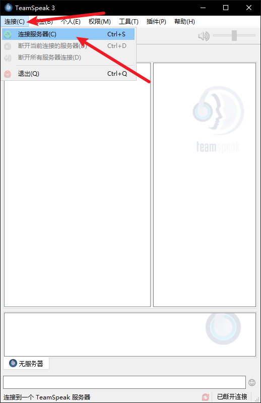

2. 输入以下信息:

   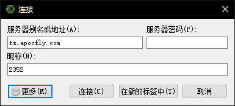

    - 服务器别名或地址: ts.apocfly.com
    - 服务器密码: 空
    - 昵称: 填写自己注册的CID

3. 连接成功

   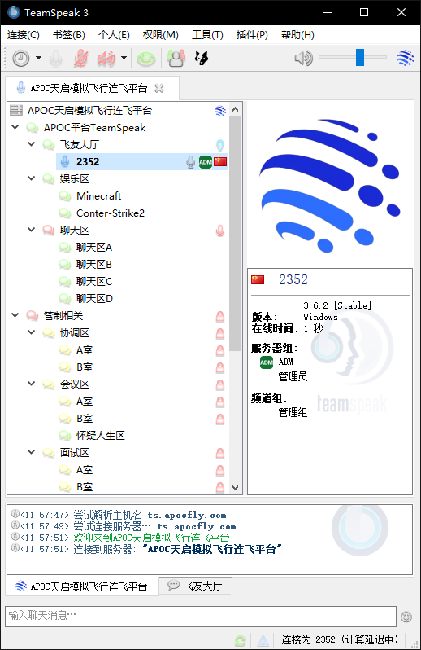

4. 进入设置页面

   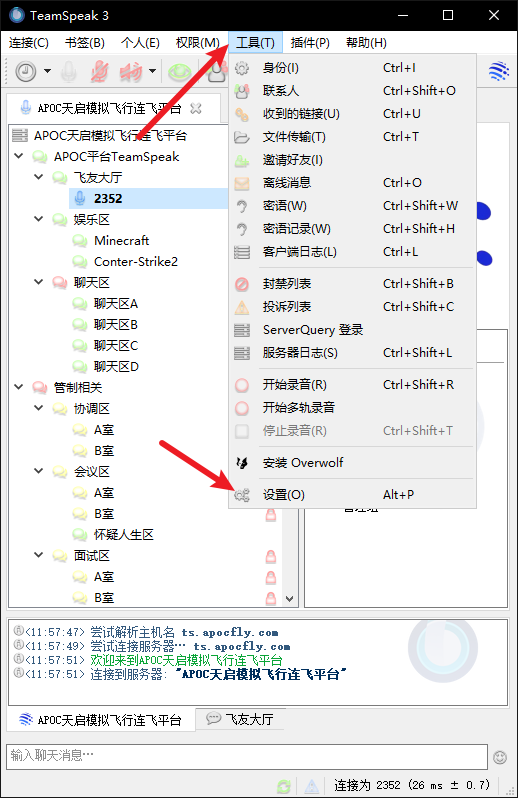

5. 设置PTT并保存

   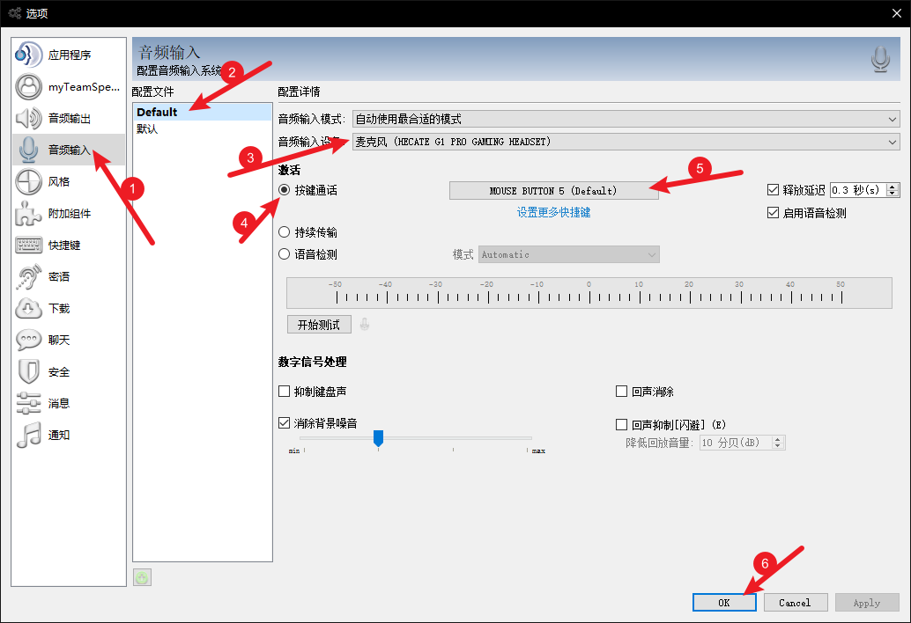