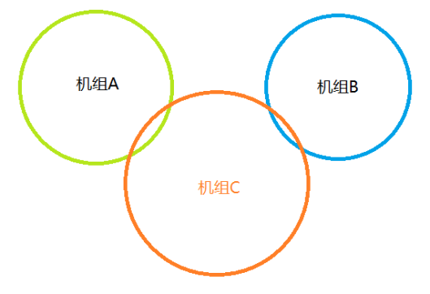

# 语音通信概述

APOC语音系统的设计核心理念是“基于模拟飞行场景，尽可能模拟现实无线电通讯”。
我们并未机械照搬真实无线电的所有复杂规则，而是在保留核心拟真要素的基础上，开发了一套更契合连飞实际使用场景的语音系统。

## 1. 频率独占与干扰机制

在真实航空无线电环境中，同一频率在同一时刻只能有一个信号源发射。若两个或以上信号源同时讲话，会产生严重的混叠干扰，导致该频率上的所有收听者均无法辨清任何信息。

APOC语音系统完整保留了这一特性：这意味着飞行员与管制员必须遵守“先听后说”原则，在发射前确认频率空闲，避免造成无意干扰。

该设计旨在培养规范的通话习惯，提升连飞活动的专业氛围。

## 2. 语音传播距离模型

现实中的VHF（甚高频）空地通信受地球曲率影响，存在视距传播距离限制。APOC语音系统引入了该物理模型，使通信范围随高度和位置动态变化。

基本规则：

- 所有连接到服务器的客户端（包括飞行员和管制员）均拥有各自的语音传播范围；
- 仅当两个客户端的传播范围之和大于或等于二者之间的实际距离时，双方才能互相听见。

传播范围的确定方式：

| 角色  | 传播范围定义                                                                                                                       |
|-----|------------------------------------------------------------------------------------------------------------------------------|
| 管制员 | 语音传播范围与视程范围相同，即管制员席位仅能覆盖其负责的空域或机场区域。                                                                                         |
| 飞行员 | 语音传播范围与当前飞行高度正相关，高度越高，通信距离越远。计算公式为： $\text{range (nm)} = \max\left(1.23 \times \sqrt{\text{altitude (ft)}},\ 10\right)$ |

## 3. 服务端处理规则

服务器按“频率”管理客户端，频率在服务端分为三类：有管制员的频道、无管制员的频道、特殊频道。

### 3.1 有管制员的频率

- 管制员上管并连接语音后，服务器会自动匹配其主频率，并将其添加到该频率的管制员列表；
- 若客户端双方均处于该管制员语音通信范围内，可以相互通信；
- 处于管制员覆盖范围以外的机组，按照[无管制员的频率](#3-2-无管制员的频率)转发；
- 一个频率可有多名管制员，语音会分别在各管制员的覆盖范围内转发。

### 3.2 无管制员的频率

- 指频率内有客户端，但管制员列表为空，或者不在管制员覆盖范围内；
- 此时转发中心为发送方：彼此在通信范围内的客户端可以相互通信，超出范围则无法听到。

### 3.3 特殊频率

- 特指 122.800 MHz（UNICOM）与 121.500 MHz（应急频率）；
- 这两个频道不允许管制员认领，始终按[无管制员的频率](#3-2-无管制员的频率)规则处理语音。

## 4. 语音传播示例

为帮助理解，以下列举两个典型场景。

### 场景1：机组间通话

假设各机组间的覆盖范围如下图所示，所有机组均在同一频率。

此时，机组A可与机组C相互通信；机组C可与机组B相互通信；但机组A与机组B不能直接通信。

### 场景2：管制与机组间通信

假设各客户端位置与覆盖范围如下图所示，所有客户端均在同一频率。

此时，机组A与管制D、机组B与管制D、机组C与管制D均可相互通信；同时，机组A、B、C也能听到其他机组的声音；但机组E只能与机组C相互通信，无法听到其他机组及管制的声音。