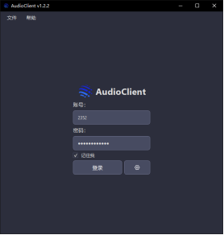
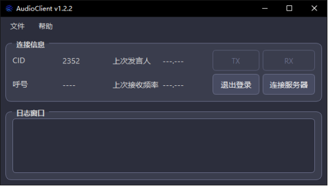
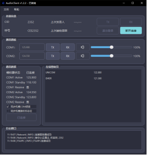
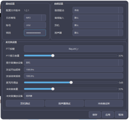
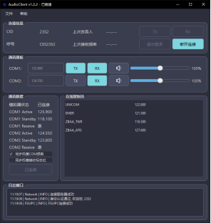
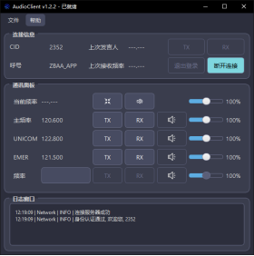
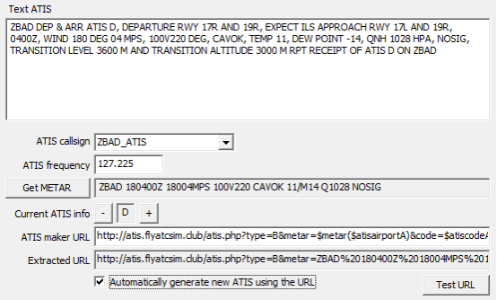

# AudioClient 使用教程

## 1. 软件的下载与安装

在正式使用之前，您需要下载并安装软件与附属产品

对于飞行员，您需要下载并安装：

1. AudioClient本体
2. FSUIPC(微软)/XPUIPC(XP)插件；可选，若没有安装不可使用机载调频功能

对于管制员，您需要下载并安装：

1. AudioClient本体
2. RDFPlugin；可选，提供发话机组的高亮显示

### 1.1. AudioClient

对于AudioClient，我们提供了两种下载方式

1. 前往[QQ群](https://qm.qq.com/q/R4UXIAkjGI)内下载
2. 前往[下载站](https://file.apocfly.com/AudioClient)下载

推荐选择最新版本下载并安装

### 1.2. FSUIPC

对于FSUIPC，我们提供了两种下载方式

1. 前往[QQ群](https://qm.qq.com/q/R4UXIAkjGI)下载
2. 前往[下载站](https://file.apocfly.com/Swift相关文件/MSFS)下载

### 1.3. XPUIPC

对于XPUIPC，我们提供了两种下载方式

1. 前往[QQ群](https://qm.qq.com/q/R4UXIAkjGI)下载
2. 前往[下载站](https://file.apocfly.com/Swift相关文件/X-Plane)下载

### 1.4. RDFPlugin

对于RDFPlugin，我们提供了两种下载方式

1. 前往空管中心QQ群下载
2. 前往[下载站](https://file.apocfly.com/EuroScope/Plugins)下载

## 2. 软件使用

### 2.1. 通用部分

双击软件图标，打开软件，等待加载完成

软件主界面如下图所示

现在我们点击登录按钮的右边设置按钮，或者点击菜单栏中的`文件->首选项`，打开设置面板，如下图所示

我们需要进行如下操作

1. 设置音频输入与输出设备
2. 设置PTT按键
3. 测试设备(点击测试按钮后需要按下PTT按键，测试是否能听到自己的声音)
4. 调整音量大小

> [!TIP]
> PTT按键、提示音播放设备和冲突音播放设备这三个配置项需要点击应用或者保存后才会生效，其余配置实时生效，推荐每次均进行一遍设备测试。

测试完成后，回到主页面，输入账号与密码，点击登录，登录成功后页面应该如下图所示

此时我们点击连接服务器

> [!NOTE]
> 一定要先使用EuroScope、Swift连接到服务器，才可点击连接。

### 2.2. 飞行员部分

如果您使用swift连接至服务器，则软件会自动路由至飞行员部分

飞行员页面如下图所示

进入该页面，首先我们需要检查左下角通讯数据面板，查看模拟器状态是否为已连接。

如果已连接，则检查COM1与COM2的当前频率与备选频率是否正确，COM1与COM2的接受标志是否与机模一致(已知微软有问题，XP没有)
，如果一致，则可以打开同步机模接受标志位。

如果未连接或者连接失败，则检查FSUIPC/XPUIPC是否正确安装并加载，或选择手动调整频率。

> [!NOTE] 本段内容仅XP玩家须知
> 由于XPUIPC未能提供支持8.33kHz的频率获取接口，所以对于XP，仅能获取到频率后两位小数，即123.456这个频率，软件仅能读取到123.45。
> 为此我们对此进行了算法层面的优化，诸如xxx.x75或者xxx.x25是可以被算法补偿的，但诸如xxx.x65这类频率是无法被正确读取的，
> 此时需要您手动关闭同步机模COM频率，然后在对应频率框内输入。

一个正确配置的典型界面应该如下图所示：

- TX：在该频率发言，如果不打开TX，则无法发送语音，同一时间内只能有一个频率的TX处于激活状态
- RX：接受该频率的语音，如果不打开RX，则无法接受该频率的语音，同一时间可以有多个频率的RX处于激活状态
- RX右侧的喇叭按钮：可以切换将该频率的语音播放设备，默认情况下是耳机，点击按钮可以切换为扬声器播放

### 2.3. 管制员部分

如果您使用EuroScope连接至服务器，则软件会自动路由至管制员部分，如下图所示

通讯面板的部分按钮操作与机组端一致，这里不再赘述

第一行的两个按钮，从左至右分别是：缩小窗口以及全频道禁音

缩小窗口点击后会隐藏主窗口，小窗口如下

该小窗口会置顶显示

#### 语音ATIS的开设与使用

服务器目前已开设语音ATIS播报功能，管制员在开设D-ATIS后，服务器会自动根据D-ATIS内容生成语音ATIS，并在对应频率播报。为了正确使用语音ATIS，管制员需要确保如下几件事：

1. 确保使用的EuroScope版本大于等于3.2.9，由于EuroScope 3.2.3的ATIS更新逻辑与3.2.9及以后版本完全不兼容，故服务器放弃了对3.2.3的兼容
2. 使用Flyatcsim提供的D-ATIS生成链接
3. 检查生成的D-ATIS是否正确无误

跑道信息是否完整无误，是否有其他问题等等

随后才可连接ATIS，如果连线后发现出现问题需要修改，则有两种解决方法

其一是完成修改后修改ATIS的号码

其二是断开ATIS完成修改后重新连线
