# 双人 / 多人机组协同驾驶教程

## 前言

双人或多人机组协同驾驶能够让多名飞行员在同一架虚拟飞机中共同完成飞行操作，为模拟飞行提供更加接近真实运行环境的体验。

本文档针对 **Microsoft Flight Simulator（MSFS 2020 / 2024）** 与 **X-Plane（XP11 / XP12）** 平台，介绍如何通过第三方插件实现多人在线协同驾驶。

本文档仅适用于模拟飞行环境，不代表真实航空运行程序或标准。

在连接至 APOC 网络前，请提前完成插件测试，并确保熟悉所使用机型。

------------------------------------------------------------------------

## 1 下载所需文件

本文档涉及的插件、配置文件及相关资源均已上传至：
[APOC 下载站](https://file.apocfly.com/)
请根据所使用的平台下载对应文件。

------------------------------------------------------------------------

## 2 Microsoft Flight Simulator（MSFS）

### 2.1 安装 FsCopilot

下载：
[Releases · yury-sch/FsCopilot](https://github.com/yury-sch/FsCopilot/releases)
`FsCopilot_v1.2.1.zip`

解压后进入：

`FsCopilot_v1.2.1\Community\fscopilot-bridge`

将 `fscopilot-bridge` 文件夹复制至 MSFS 的 `Community` 文件夹。

如需支持更多机型，可前往 FsCopilot 官方网站或官方 Discord 获取更多 Profile：

- [官方网站](https://fscopilot.com/)
- [官方 Discord](https://discord.com/invite/HyKMRp47ka)

### 2.2 建立连接

1.  启动 `FsCopilot.exe`。
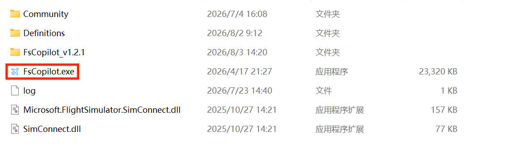
2.  将左上角 `Client Code` 发送给机组伙伴。
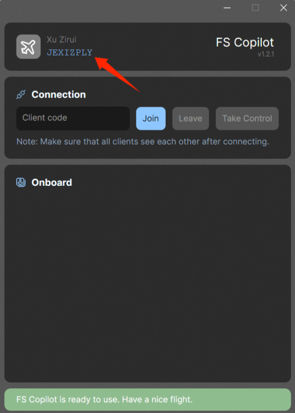
3.  伙伴输入代码并点击 `Join`。
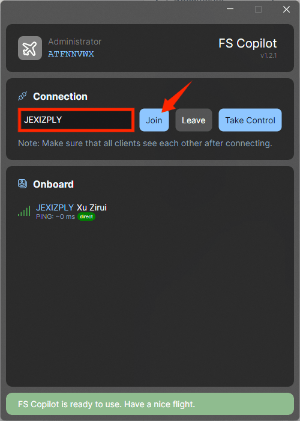

连接成功后即可开始协同飞行。

------------------------------------------------------------------------

## 3 X-Plane（XP11 / XP12）

### 3.1 安装 SmartCopilot

下载：
 [Download ⋆ Sky4Crew](https://sky4crew.com/download/)
`SmartCopilot-3.3.0`

解压后放入：

`X-Plane 主目录\Resources\plugins`

------------------------------------------------------------------------

### 3.2 建立连接

主控方：

1.  打开 X-Plane。
2.  进入 SmartCopilot 设置。
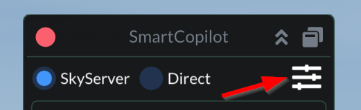
3.  点击 `Start`。
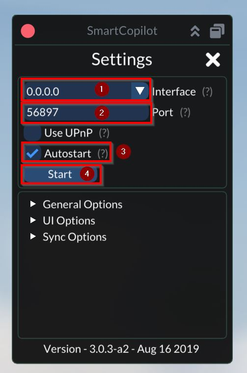
4.  选择 `Master`。
5.  发送连接代码。

从控方：

1.  选择 `Slave`。
2.  输入连接代码。
3.  点击 `Join`。
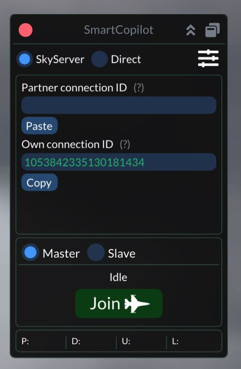

主控方点击 `Allow` 后完成连接。
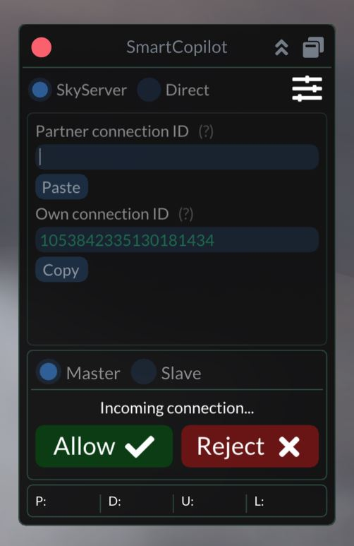

------------------------------------------------------------------------

## 4 注意事项

### 4.1 MSFS

| 项目   | 说明                        |
| ---- | ------------------------- |
| 版本兼容 | MSFS 2020 与 MSFS 2024 可互连 |
| 前置设置 | 双方保持相同机模、地景、飞机状态及模拟设置     |
| 控制权  | `Take Control` 用于控制权切换    |
| 同步内容 | 航路、性能及配载可能不同步，建议推出前确认     |

### 4.2 X-Plane

| 项目   | 说明                                |
| ---- | --------------------------------- |
| 版本要求 | XP11 与 XP12 不互通，不同 XP12 版本也可能无法连接 |
| 控制权  | Master 默认拥有控制权                    |
| 同步内容 | 航路、性能及配载可能不同步                     |
---------- ---------------------------------------------------

### 4.3 控制权说明 

在协同飞行过程中，控制权用于协调机组成员对飞机主要操纵系统的操作，避免多人同时输入导致操纵冲突。

建议在正常连飞过程中明确分工：

- PF（Pilot Flying）负责操纵飞机并持有控制权；
- PM（Pilot Monitoring）负责监控、检查以及执行非操纵类操作。

**以下将对不同插件在控制权机制上的差异进行说明：**
#### FsCopilot
当某一成员拥有控制权（Take Control为灰色）时，该成员可以操作：

- **油门（Throttle）**
  - 包括发动机推力控制；
  - 另一成员无法同时修改油门输入。

- **摇杆 / 操纵装置（Flight Controls）**
  - 包括俯仰、横滚、方向舵等飞行操纵输入；
  - 用于避免多人同时操纵导致飞机状态异常。

- **自动驾驶（Autopilot）**
  - 包括自动驾驶系统相关操作；
  - 在不同控制模式下，自动驾驶控制权的表现有所区别：
    - **管理模式（LNAV / VNAV）**
      - 飞机将按照拥有自动驾驶控制权成员所设定的航线进行飞行；
      - 其他成员的航线输入不会影响当前飞机自动驾驶轨迹。
    - **开放模式（HDG / V/S）**
      - 自动驾驶控制权不限制航线控制；
      - 各成员的自动驾驶相关输入均可正常生效，不受控制权归属影响。

需要注意：

- 控制权仅限制上述主要操纵项目；
- 飞机其他系统状态（如开关、按钮、面板设置等）仍保持双向同步；
- 建议飞行过程中由固定成员持有控制权，避免频繁切换造成误操作。

#### SmartCopilot
拥有控制权的成员可以操作：

- **油门（Throttle）**
- **摇杆 / 飞行操纵系统（Flight Controls）**

控制权不限制：

- 飞机开关状态；
- 飞行仪表设置；
- 航电面板操作；
- 其他同步项目。

当从控方需要操作主要操纵系统时，应通过 `Request` 请求控制权。
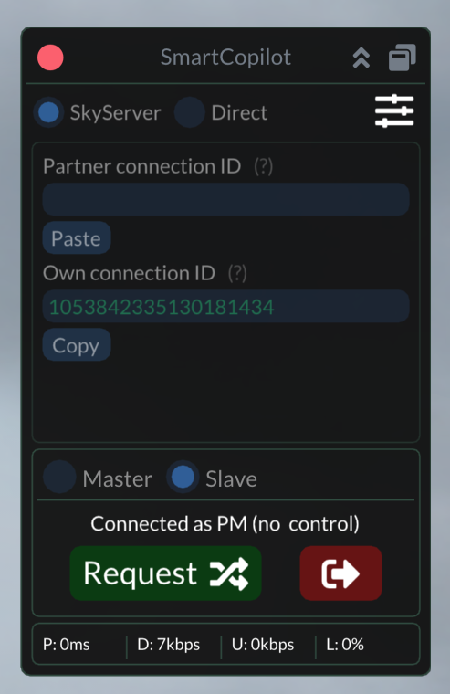
由当前主控方通过 `Release` 释放控制权后完成交接。
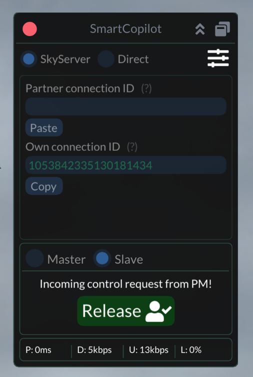

------------------------------------------------------------------------

## 5 APOC 连线飞行说明

双人或多人机组情况下：

-   仅由主控方提交飞行计划；
-   其他成员无需重复提交；
-   其他成员选择观察员模式。

观察员呼号格式：

`主控呼号 + A / B / C`

示例：

主控：

`CCA7086`
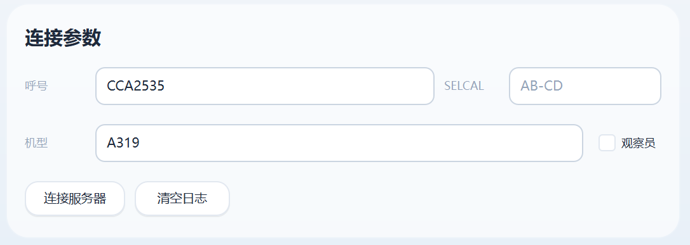

成员：

    CCA7086A
    CCA7086B
    CCA7086C
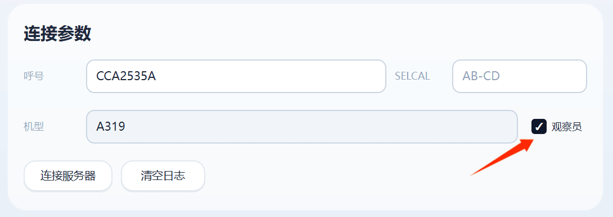

------------------------------------------------------------------------

## 6 活动联飞注意事项

如因协同插件异常导致违反 APOC CoC（Code of Conduct）：

> 双方机组成员承担同等责任。

建议正式活动前完成插件连接、控制权切换以及同步测试。

------------------------------------------------------------------------

## 后记

双人或多人机组飞行不仅是一项技术功能，更是一种团队协作体验。

规范操作、提前测试和良好沟通，是保证联飞体验的重要基础。

愿各位飞行员安全飞行，蓝天相伴。

------------------------------------------------------------------------

## 参考资料

-   [FS Copilot — Shared Cockpit for MSFS 2024](https://fscopilot.com/)
-   [Install ⋆ Sky4Crew](https://sky4crew.com/install/)