Hoppie Acars DCL教程

前言

在模拟飞行联飞过程中，机组通常需要通过语音频率向管制申请离场放行。但在高峰时段，频率拥挤、等待时间较长，或者由于通信质量、语言差异等因素，都可能影响放行效率。

DCL（数字放行）则提供了一种更加高效的方式。它通过ACARS数据链系统，使机组能够直接向管制发送放行申请，并接收数字化的离场放行指令，大幅减少传统语音通信需求。

本教程将以空客系列飞机为例，带大家完整了解Hoppie Acars DCL的使用流程，包括：

* Hoppie's ACARS账号注册与配置
* ACARS数据链连接设置
* Fenix A320完整DCL操作流程
* FlyByWire A32NX操作区别
* iniBuilds A350操作区别
* ToLiss系列飞机操作区别
* A340 DCL使用方式

通过本教程，你将掌握从准备阶段到完成数字放行的完整操作流程。

1. Hoppie’s ACARS配置

1.1注册Hoppie’s ACARS账号

首先进入Hoppie's ACARS页面。（[Hoppie's ACARS Registration](https://www.hoppie.nl/acars/system/register.html)）

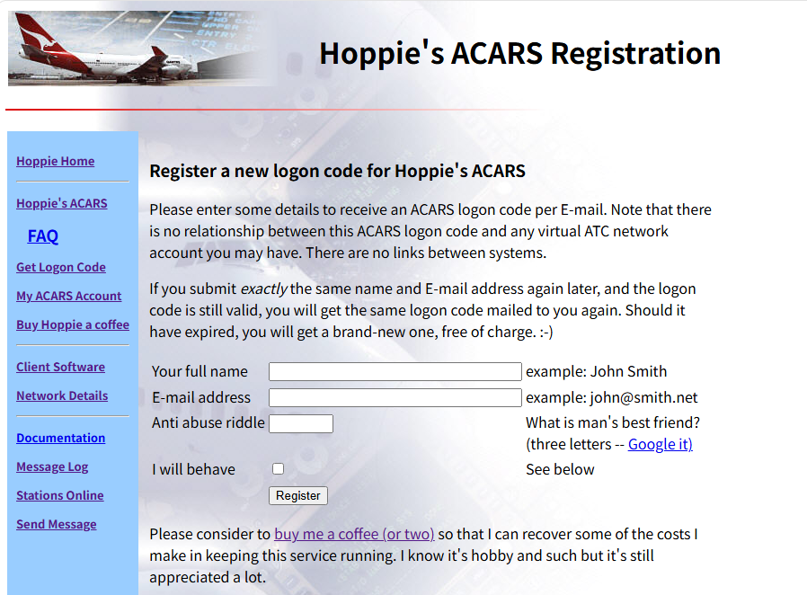

点击：

**Get Logon Code**

随后填写注册信息：

* Name（姓名）
* Email（邮箱）
* Verification Question（验证问题） （答案：DOG）

完成验证后，同意相关条款并提交注册。

注册成功后，系统会向填写的邮箱发送一封邮件，其中包含你的：

**Hoppie Login Code**

该代码将在后续飞机插件配置中使用。

1.2配置Hoppie’s ACARS账号

进入Hoppie’s ACARS网站，点击My ACARS Account。

输入邮箱和LOGON CODE，点击Retrieve Account。

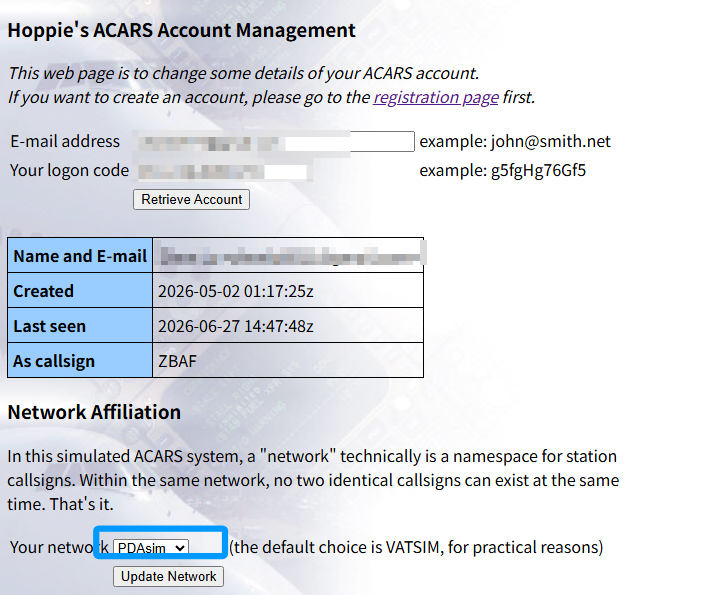

下方Your Network 选择PDAsim并点击Update Network。

1.3在机模中配置ACARS

以Fenix为例，开启Fenix外挂软件

选择Hoppie，输入LOGON CODE，点击APPLY。

如果右侧出现绿色勾选标志，说明：

* ACARS数据链配置成功
* 飞机可以使用DCL功能

1. Fenix DCL放行教程

2.1开启DCDU

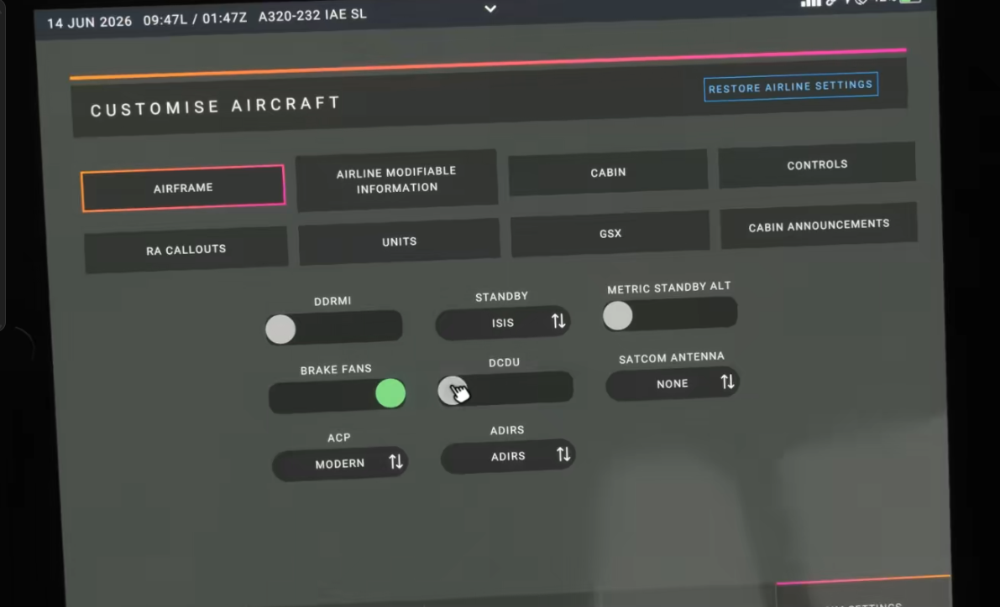

打开Fenix平板

进入 **SIM SETTINGS**

开启 **DCDU。**

2.2初始化信息设置

完成MCDU INIT页信息输入

返回MCDU MENU

MCDU MENU

↓

ATSU

↓

AOC MENU

↓

FLT INIT

填写：

* 航班信息

或：

* 使用Simbrief导入FLT INIT

2.3发送DCL申请

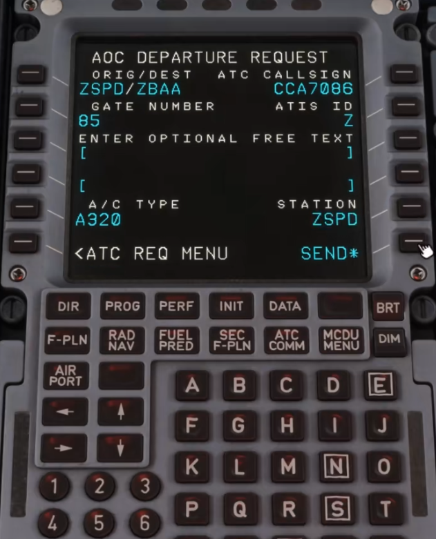

进入：

AOC MENU

↓

ATC REQ

↓

PRE DEP CLRNCE

填写：

**GATE NUMBER**

* 当前停机位编号

**ATIS ID**

* 当前机场ATIS代码

**STATION**

* 对应管制席位登录代码

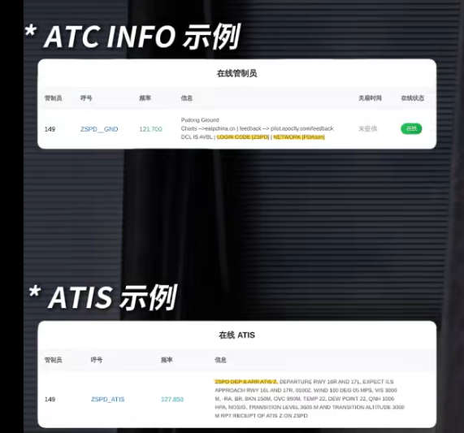

2.4接收管制放行

等待管制回复：

* ATC MSG提示灯亮起
* DCDU显示放行信息

操作：

* 阅读放行内容
* 检查是否可以执行

2.5接受并发送放行

DCDU：

选择：

* WILCO

然后：

* SEND

完成数字放行。

2.6查看历史放行记录

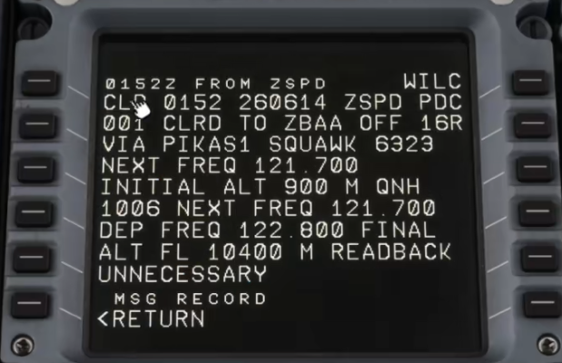

进入：

ATC COMM

↓

MSG RECORD

查看已接收的放行信息。

1. 其余空客机型操作区别

3.1Flybywire A32NX

主要区别：

* 需要先确认ACARS连接

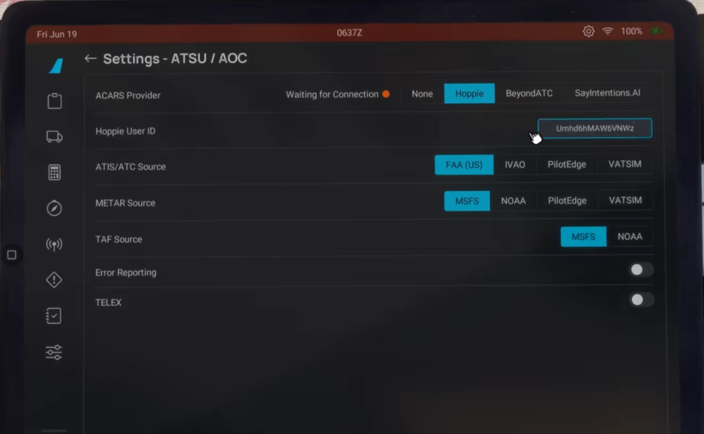

MCDU中选择：

* XFR TO DCDU

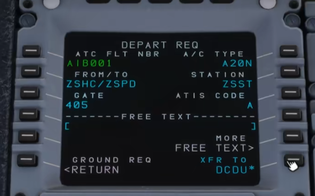

* 将信息转移至DCDU后发送

3.2iniBuilds A350

DCL入口：

ATC COM页面

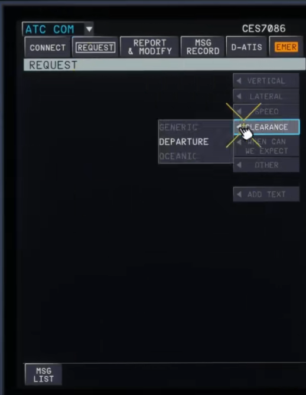

操作区别：

* 需要选择：

XFR TO MAILBOX

将放行信息转入Mailbox

再发送。

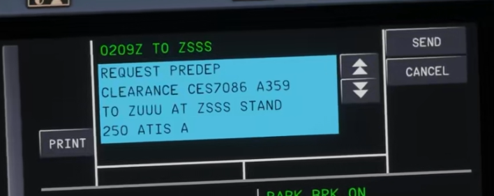

3.3Tollis A346

区别：

Login Code输入方式：

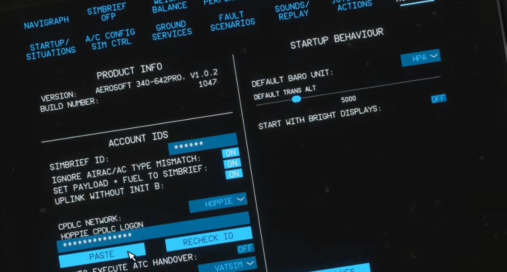

* 无法直接键盘输入
* 需要复制Login Code
* 点击PASTE完成输入

FLT INIT输入方式：

不需要手动填写FLT INIT

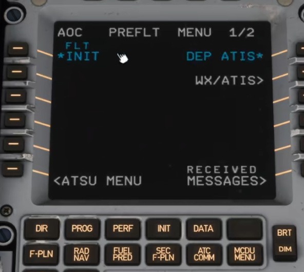

点击L1，自动读取Simbrief数据。

1. 注意事项

4.1申请放行时机

* 驾驶舱准备完成后申请DCL
* 避免过早申请导致运行混乱

4.2保持频率守听

虽然DCL减少语音交流：

仍需：

监听管制频率，注意管制呼叫

4.3异常情况处理

遇到：

* 无法执行指令
* 对放行内容有疑问
* DCL申请失败

处理：

转回语音通信，与管制协调

结语

希望通过本教程，能够帮助更多飞友掌握DCL的使用方法，在未来的联飞活动中更加熟练、高效地完成放行流程。