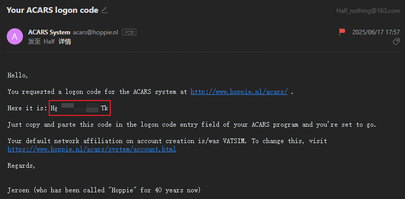
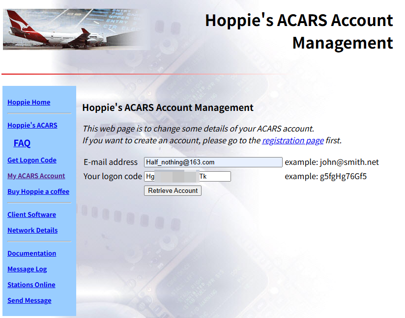
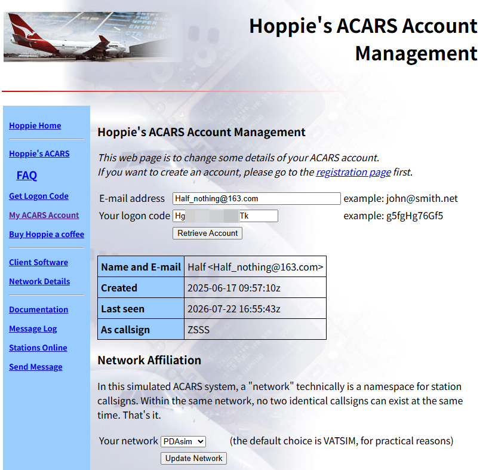
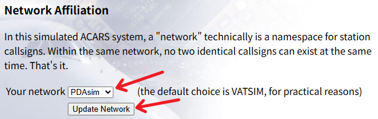
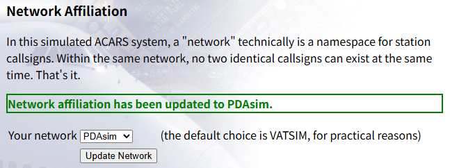
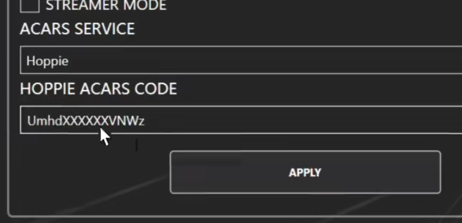
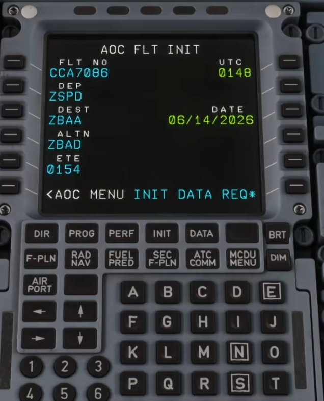
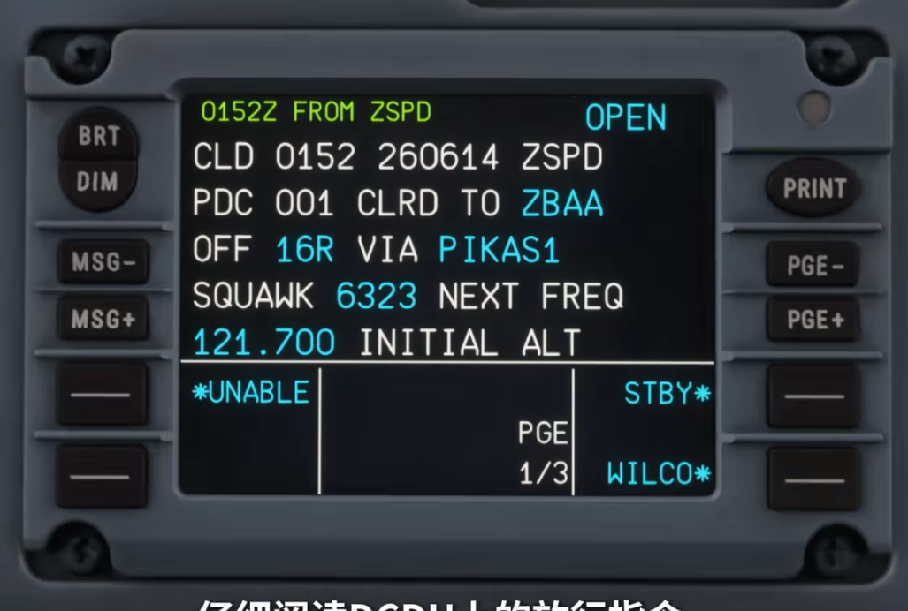
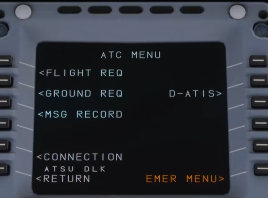
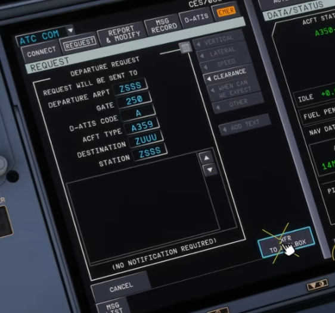

# Hoppie ACARS DCL使用教程

## 前言

在模拟飞行联飞中，机组通常通过语音频率向管制申请离场放行。
然而，高峰时段的频率拥堵、通信质量波动或语言差异，往往影响放行效率，延长等待时间。

DCL（数字放行）为此提供了更高效的替代方案。它依托ACARS数据链系统，
让机组可直接向管制发送放行申请，并实时接收数字化的离场放行指令，显著减少对传统语音通信的依赖。

本教程以空客系列飞机为核心，系统讲解Hoppie ACARS DCL的完整使用流程，涵盖以下内容：

- `Hoppie's ACARS`(后文简称为`Hoppie`)账号注册与配置
- ACARS数据链设置
- Fenix A320 完整DCL操作流程
- FlyByWire A32NX操作差异
- iniBuilds A350操作差异
- ToLiss系列飞机操作差异
- A340 DCL使用方式

通过本教程，你将掌握从飞行准备阶段到成功获取数字放行的全流程操作，从容应对联飞中的放行环节。

## 1. Hoppie 配置

### 1.1 注册 Hoppie 账号

> [!TIP]
> 如已拥有 Hoppie 账号，可直接跳至 [1.2](#1-2-配置hoppie账号)。

访问 [Hoppie 注册页面](https://www.hoppie.nl/acars/system/register.html)：

随后填写注册信息：

- **Your full name**：输入您的姓名或昵称
- **E-mail address**：输入有效的电子邮箱地址
- **Anti abuse riddle**：输入 `DOG`
- **I will behave**：勾选确认

填写完毕后，点击 `Register` 按钮提交注册申请。

注册成功后，Hoppie 会向您的邮箱发送一封确认邮件，示例如下：

邮件中红框标注的部分即为您的 `Hoppie Logon Code`(后文简称为`Logon Code`)，通常为一串随机字符（例如 `LGYvKXIKi0PBYjAe`）。

> [!CAUTION]
> 请妥善保管您的`Logon Code`，该代码相当于您的登录凭证，请勿随意泄露给他人。

> [!TIP]
> 请注意，若连续**120 天**未使用您的`Logon Code`，该`Logon Code`将被系统**回收**，届时需重新申请。

### 1.2 配置Hoppie账号

访问 [Hoppie 登录页面](https://www.hoppie.nl/acars/system/account.html)

输入注册填写的邮箱和从邮件中获取的`Logon Code`，点击`Retrieve Account`。

如果内容填写正确会显示如下页面

我们主要需要操作的是`Network Affiliation`板块

在`Your network`下拉框中选择需要切换的网络，对于本平台目前来说，通常是`PDAsim`

> [!NOTE]
> 通常来说本平台的管制员会在`PDAsim`网络上提供CPDLC和DCL服务，但平台并未强制规定网络  
> 故具体使用什么网络请以`ATC INFO`为准，若您确实不太清楚，请在管制员空闲时向其询问

选择完网络后，记得点击`Update Network`

如果显示如下所示，代表网络切换成功

> [!TIP]
> 由于网络切换并不是实时生效，我们推荐您在使用Hoppie之前先切换网络

### 1.3 在机模中配置ACARS

以[Fenix](https://fenixsim.com)为例，首先打开Fenix外挂软件

`ACARS SERVICE` 选择 `Hoppie`，`HOPPIE ACARS CODE` 输入 `Logon Code`，随后点击APPLY

如果右侧出现绿色勾选标志，代表ACARS数据链配置成功，飞机现在可以使用DCL功能

## 2. Fenix DCL放行教程

### 2.1 开启DCDU

打开Fenix平板

进入**SIM SETTINGS**，开启 **DCDU**。

### 2.2 初始化设置

首先完成MCDU的INIT页信息输入

然后按顺序点击 `MCDU MENU` -> `ATSU` -> `AOC MENU` -> `FLT INIT`

手动填写航班信息或者使用Simbrief导入，最后页面应当与下图类似

### 2.3 发送DCL申请

按顺序点击 `MCDU MENU` -> `ATSU` -> `AOC MENU` -> `ATC REQ` -> `PRE DEP CLRNCE`

需要填写如下内容：

- **GATE NUMBER**: 当前停机位
- **ATIS ID**: 当前机场ATIS代码
- **STATION**: 对应管制席位代码

最终填写完成应与下图类似

所有必填项目填写完成后，右下角的`SEND`会变成`SEND*`，此时可以点击`SEND*`旁边的按钮发送DCL请求

### 2.4 接收放行信息并接受

当收到管制员回复的消息后

- ATC MSG提示灯亮起
- DCDU显示信息

此时需要阅读信息内容，判断是放行信息，还是拒绝消息

如果为放行消息，结合实际情况判断是否接受

如果接受，在`DCDU`上选择`WILCO`，随后点击`SEND`完成DCL请求。

### 2.5 查看历史放行记录

按顺序点击 `ATC COMM` -> `MSG RECORD`

在此页面可以查看已接收的放行信息

## 3. 其余空客机型操作区别

### 3.1 FlyByWire A32NX

同样需要先确认ACARS连接

需要先将信息转移至`DCDU`后，才能发送

### 3.2 iniBuilds A350

DCL请求入口在 `ATC COM` -> `CLEARANCE` -> `DEPARTURE`

需要先将信息转移至`Mailbox`后，才能发送

### 3.3 Tollis A346

无法直接键盘输入`Login Code`，需要复制`Login Code`，随后点击`PASTE`完成输入

不需要手动填写`FLT INIT`，点击`左1`，自动读取Simbrief数据

## 4. 注意事项

### 4.1 申请放行时机

请先完成驾驶舱准备，再申请DCL，避免过早申请导致运行混乱

### 4.2 保持守听管制频率

虽然DCL放行不用复述，但作为飞行员仍需守听管制频率，注意管制呼叫

### 4.3 异常情况处理

如果无法执行指令或者对放行内容有疑问或者DCL申请失败

请转回语音通信，与管制协调

## 结语

希望通过本教程，能够帮助更多飞友掌握DCL的使用方法，在未来的联飞活动中更加熟练、高效地完成放行流程。
