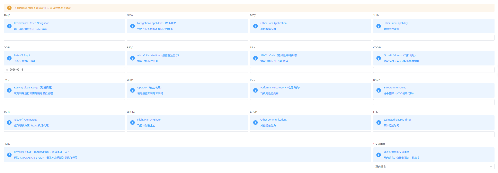

# 飞行计划提交

> [!CAUTION]
> 请尽量使用飞控提交您的飞行计划，[v1](https://v1.pilot.apocfly.com/flight-plan)
> 或者[v2](https://pilot.apocfly.com/flight-plans)均可，尽量避免使用swift提交计划

本次教程，我们将会使用[飞控v1.0版本](https://v1.pilot.apocfly.com/flight-plan)进行演示。此外，由于网页布局，我们将飞行计划的填写分为上半部分、下半部分。

## 上半部分

- 呼号：三位航司+航班号，[在此处查询](https://www.avcodes.co.uk/airlcodesearch.asp)。也可填写飞机注册号，通常在飞机外部
- 飞行类型：IFR（仪表飞行规则）/ VFR（目视飞行规则），通常选择IFR
- 飞机类型（ICAO）：[在此处查询](https://doc8643.com/aircrafts)
- 尾流分类：按照飞机最大起飞重量进行填写，[在此处查询](https://www.icao.int/publications/doc-8643-aircraft-type-designators/search)

> [!Note]
> 填写的为：WTC（ICAO**四类**），而不是RECAT-CN分类。可[在此](../pilot/aircraft_type)，了解更多

- 设备代码（ICAO/FAA）：通用代码（SDE2E3FGILRWXY）。此部分比较复杂，将在完整计划填写完成后再次进行解析。
- 二次雷达代码（仅ICAO）：通用代码（LB2）。同上，将在后文阐述。
- 离场机场（ICAO）：[在此查询](https://airportcodes.aero/)
- 离场时间（HHMM）：填写航空器预计离场的时间（UTC时间），[在此查询](https://time.is/zh/UTC)
- 巡航高度（ft）：推荐填写8900-12500米之间的飞行高度层，需要符合东单西双原则，[在此查询](./RVSM_flight_level.md)
- 巡航真空速（knots）：按照飞机正常的巡航真空速填写（不是马赫数）。如果您不知道，也可填写最大巡航速度，[在此查询](https://skybrary.aero/aircraft-types)，管制员对此部分内容不进行检查
- 到达机场（ICAO）：同离场机场，[在此查询](https://airportcodes.aero/)
- 备降机场（ICAO）：非必填项，顾名思义
- 飞行时间（HHMM）：整段飞行完成需要的时间，格式：HHMM，H=小时，M=分钟
- 滞空时间（HHMM）：飞行中空中的时间，同上
- 航路

## 下半部分

以下内容除通讯以外，均为非必要填写，仅为提升模拟沉浸感使用：

- `PBN/`：PBN码，通用代码（A1B1C1D1L1O2S2）。同上，将在后文阐述
- `NAV/`：包括PBN多余的还有自己独属的。同上，将在后文阐述
- `DAT/`：其他数据应用
- `SUR/`：其他监视能力
- `DOF/`：飞行计划执行日期，UTC时间
- `REG/`：飞机注册号，如：B-1234
- `SEL/`：SELCAL代码，在越洋飞行中使用，通常位于飞机驾驶舱中部
- `CODE/`：填写24位ICAO分配的机载地址
- `RVR/`：特殊运行所需的跑道最低视程
- `OPR/`：航空公司的三字码，与Callsign处填写的一致
- `PER/`：飞机的性能类别
- `RALT/`：途中备降（ICAO机场代码）
- `TALT/`：起飞替代方案（ICAO机场代码）
- `ORGN/`：飞行计划制定者，填写自己的名称即可
- `COM/`：其他通信能力
- `EET/`：预计经过时间
- `RMK/`：Remarks（备注）填写额外信息，可以备注TCAS*。例如：EXERCISE FLIGHT 表示本次航班为训练飞行等
- 交流类型：
    - 双向语音（V）
    - 仅接受文字（R）
    - 仅文字（T）

未完待续...

## 参考资料

[1] [Hongye Rudi Zhang.VATSIM 新版飞行计划 如何填写？](https://community.vatprc.net/t/topic/10670)
[2] [Peixi Li.关于放行管制员检查航空器设备和监视代码的通知](https://community.vatprc.net/t/topic/9695)
[3] [Hongye Rudi Zhang.VATSIM新版飞行计划规范及指南](https://community.vatprc.net/t/topic/6068)
